# Coding Report

## Question 1
This question requires us to calculate the sample means, medians, modes, variances and standard deviations from the `UTC visitor's statistic year 2013-17` dataset. 
It also requests us to draw a graph to summarize features that draw a distinction between the visitor satistics to conclude and inference on the reasons of the data occurences.
`We are only required to do the above for areas "Perak", "Melaka" and "Wilayah Persekutuan Kuala Lumpur"`

The [UTC visitor’s statistic year 2013-2017](http://www.data.gov.my/data/dataset/028b136e-fcbf-426f-9a52-2de2a21cfbef/resource/ce75b7bf-9740-45d1-b703-3372e7001cab/download/statistik-utc-negeri-mengikut-bulan-2013-2017.xlsx) dataset was downloaded from the govenment's open data webpage. It describes the number of visitors visiting the Urban Transformation Center in each state every month.

As we are calculating the mean, median, variance and standard deviation of the data, we will using the following formulae:

- Mean of a sample


- Median of a sample


- Variance of a sample


- Standard deviation of a sample


### The following codes were used (output line breaks are omitted):
- We first import the data requried:
  ```
  library(readxl)
  
  # Import the dataset
  data <- read_xlsx("./data/utc_stat.xlsx", 1)
  
  # Select only Melaka, WP KL, and Perak States data
  year_char <- data[-1,2]
  melaka_visitor <- data[-1,3]
  wp_visitor <- data[-1,4]
  perak_visitor <- data[-1,5]
  ```

- We then preprocess the data:
  ```
  # Convert dataframe to numerical variables
  melaka_visitor = as.numeric(unlist(melaka_visitor))
  wp_visitor = as.numeric(unlist(wp_visitor))
  perak_visitor = as.numeric(unlist(perak_visitor))
  
  # Create a new dataframe of only this 3 states data
  States_df <- data.frame(year_char,melaka_visitor, wp_visitor, perak_visitor)
  ```

- We then calculate the values based on the problem requirements:
  - Mean
    ```
    mean_melaka = mean(melaka_visitor)
    mean_wp = mean(wp_visitor)
    mean_perak = mean(perak_visitor)
    ```
  - Median
    ```
    median_melaka = median(melaka_visitor)
    median_wp = median(wp_visitor)
    median_perak = median(perak_visitor)
    ```
  - Mode
    ```
    mode_melaka = max(melaka_visitor)
    mode_wp = max(wp_visitor)
    mode_perak = max(perak_visitor)
    ```
  - Variance
    ```
    var_melaka = var(melaka_visitor)
    var_wp = var(wp_visitor)
    var_perak = var(perak_visitor)
    ```
  - Standard Deviation
    ```
    sd_melaka = sd(melaka_visitor)
    sd_wp = sd(wp_visitor)
    sd_perak = sd(perak_visitor)
    ```

- The results were outputted:
  ```
  cat("Result:\n\n Mean Melaka:",mean_melaka,"\n Mean WP:",mean_wp,"\n Mean Perak:",mean_perak,"\n \n Median Melaka:",median_melaka,"\n Median WP:",median_wp,"\n Median Perak:",median_perak,"\n \n Mode Melaka:", mode_melaka,"\n Mode WP:", mode_wp,"\n Mode Perak:", mode_perak,"\n\n Variance Melaka:", var_melaka, "\n Variance WP:", var_wp, "\n Variance Perak:",var_perak,"\n\n SD Melaka:",sd_melaka,"\n SD WP:",sd_wp,"\n SD Perak:",sd_perak)
  ```
  > Output:
  > ```
  > Mean Melaka: 93756.12 
  > Mean WP: 123094.8 
  > Mean Perak: 176081.4 
  > 
  > Median Melaka: 96719 
  > Median WP: 122446.5 
  > Median Perak: 161672.5 
  > 
  > Mode Melaka: 163386 
  > Mode WP: 173210 
  > Mode Perak: 425000 
  > 
  > Variance Melaka: 875363366 
  > Variance WP: 338842768 
  > Variance Perak: 2710490245 
  > 
  > SD Melaka: 29586.54 
  > SD WP: 18407.68 
  > SD Perak: 52062.37
  > ```

- The barplots are then drawn:
  - Barplots of Melaka States Visitor
    ```
    barplot(States_df$melaka_visitor, main = "Bar Plots of Melaka States Visitor", col="skyblue")
    ```
    > Output:
    > 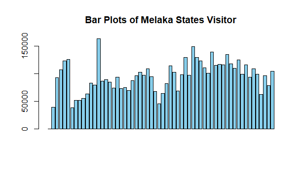
  - Barplots of WP States Visitor
    ```
    barplot(States_df$wp_visitor, main = "Bar Plots of WP States Visitor", col="green")
    ```
    > Output:
    > 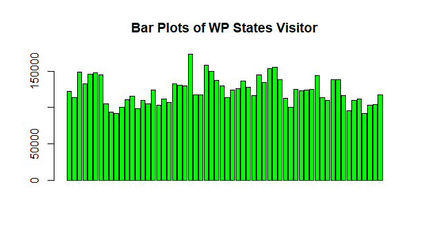
  - Barplots of Perak States Visitor
    ```  
    barplot(States_df$perak_visitor, main = "Bar Plots of Perak States Visitor", col="red")
    ```
    > Output:
    > 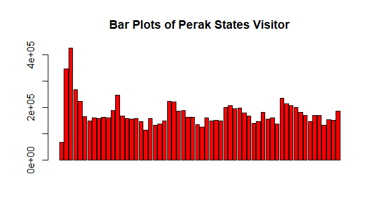

- The density plots are then drawn:
  - Density plot of Melaka States Visitor
    ```
    plot(density(States_df$melaka_visitor), main = "Density of melaka visitor", col="skyblue" )
    ```
    > Output:
    > 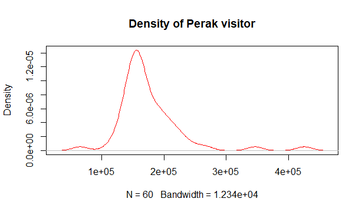
  - Density plot of WP States Visitor
    ```
    plot(density(States_df$wp_visitor), main = "Density of WP visitor", col="green" )
    ```
    > Output:
    > 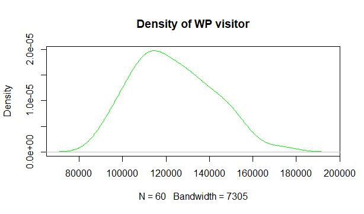
  - Density plot of Perak States Visitor
    ```
    plot(density(States_df$perak_visitor), main = "Density of Perak visitor", col="red" )
    ```
    > Output:
    > 
    
- The combined chart for visitors of each state with respect of month was then plotted:
  ```
  plot(States_df$perak_visitor,type = "o",col = "red", xlab = "Month", ylab = "Number of visitor", 
       main = "Melaka, WP and Perak Visitor Chart")
  lines(States_df$wp_visitor, type = "o", col = "green")
  lines(States_df$melaka_visitor, type = "o", col = "skyblue")
  legend("topright", legend=c("Perak", "WP", "Melaka"),col=c("red", "green","skyblue"), lty=1, cex=0.8)
  ```
  > Output:
  > 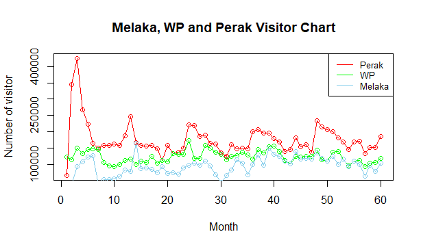

  ### Conclusion
  

---
## Question 2
This question presents a problem to calculate the probability of getting a specific branded phone with a specific condition. (E.g. The probability of getting an `Apple` branded phone with `good` condition)

[This data](./src/data/Q2_data.txt) was collected randomly from people around, where those people having only phones with brands `Apple`, `Samsung` and `Xiaomi` were required to rate their current phone situation from the metrics `Excellent`, `Good` and `Bad`.

As we are only evaluating probabilities of a given scenario, we therefore will be using the following formulae:

- Probability of A and B (Intercept)  
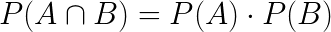

- Probability of A or B (Union)  
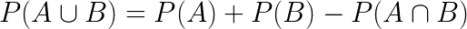

- Conditional Probability  


Where each `A` and `B` refer to their own criteria.

### The following codes were used (output line breaks are omitted):

- We first import the data after collecting them:
  ```
  Q2_data <- read.delim("./data/Q2_data.txt")
  View(Q2_data)
  rows = nrow(Q2_data)
  print(cat(rows, "rows of data imported."))
  ```
  > Output:
  > ```
  > 60 rows of data imported.NULL
  > ```

- We then calculate the frequencies (E.g. How many times a brand or a condition happened) and the proportion of each data (E.g. What is a good phone's appearance proportion). The frequency table is then displayed.
  ```
  # Assigns brand and condition variables
  brand = Q2_data$phone_brand
  condition = Q2_data$condition
  
  # Calculating the occurence of each attribute
  brand.freq = table(brand)
  condition.freq = table(condition)

  # Calculating the occurence of each state
  dataOccurence = paste(Q2_data$phone_brand, Q2_data$condition)
  dataOccurence.freq = table(dataOccurence)
  
  # Calculating the probablities of the occurences
  brand.prob = brand.freq / rows
  condition.prob = condition.freq / rows
  dataOccurence.prob = dataOccurence.freq / rows
  
  # Showing the results in a table
  cbind(brand.freq)
  cbind(condition.freq)
  ```
    > Output:
    > ```
    >           brand.freq
    > Apple           24
    > Samsung         20
    > Xiaomi          16
    > 
    >           condition.freq
    > Bad                   28
    > Excellent             13
    > Good                  19
    > ```


- We then define functions for `and`, `or` and `givenThat`(conditional probability).
  - And
    ```
    and <- function(brandName, conditionStatus){
    return(brand.prob[[brandName]] * condition.prob[[conditionStatus]])
    }
    ```
  - Or
    ```
    or <- function(brandName, conditionStatus){
    return(brand.prob[[brandName]] + condition.prob[[conditionStatus]]-and(brandName, conditionStatus))
    }
    ```
  - Given that (Conditional probability)
    ```
    given <- function(condition, givenThat){
    return(dataOccurence.freq[[condition]] / givenThat)
    }
    ```
  Where:
    - [string] `condition` is the brand name and condition to be selected from the table.
    - [long] `givenThat` is the frequency of the source condition. (E.g. if wanting to evaluate P(A|B), then the value of n(B) should be passed.)

- We then input the variables based on the problem requirements:
  - The probability that a phone is branded `'Samsung'` and has `good` condition
    ```
    print("a) The probability that a phone is branded 'Samsung' and has good condition is :")
    print(and("Samsung", "Good"))
    ```
    > Output:
    > ```
    > [1] 0.1055556
    > ```

  - The probability that a phone is branded `'Apple'` and has `bad` condition
    ```
    print(and(brandName = "Apple", conditionStatus = "Bad"))
    ```
    > Output:
    > ```
    > [1] 0.1866667
    > ```
  
  - The probability that the phone is branded `'Samsung'` and `'Apple'`  
    ```
    It is impossible to find a phone that is both branded "Samsung" and "Apple", therefore the probability is 0.
    ```

  - The probability that a phone is branded `'Xiaomi'` or have `good` condition
    ```
    print(or("Xiaomi", "Good"))
    ```
    > Output:
    > ```
    > [1] 0.4988889
    > ```

  - The probability that a phone is branded `'Xiaomi'` or have `excellent` condition
    ```
    print(or(conditionStatus = "Excellent", brandName = "Xiaomi"))
    ```
    > Output:
    > ```
    > [1] 0.4255556
    > ```

  - The probability that a phone is branded `'Xiaomi'` or `'Apple'`
    ```
    print(brand.prob[["Xiaomi"]] + brand.prob[["Apple"]])
    ```
    > Output:
    > ```
    > [1] 0.6666667
    > ```

  - The probability that a phone is having a good condition given a brand.
    - The probability that a phone is having a `good` condition given that it is branded `'Apple'`
    ```
    print(given("Apple Good", brand.freq[["Apple"]]))
    ```
    > Output:
    > ```
    > [1] 0.3333333
    > ```

    - The probability that a phone is having a `good` condition given that it is branded `'Xiaomi'`
    ```
    print(given("Xiaomi Good", brand.freq[["Xiaomi"]]))
    ```
    > Output:
    > ```
    > [1] 0.375
    > ```

    - The probability that a phone is having a `good` condition given that it is branded `'Samsung'`
    ```
    print(given("Samsung Good", brand.freq[["Samsung"]]))
    ```
    > Output:
    > ```
    > [1] 0.25
    > ```

  ### Conclusion
  Therefore from the data:
  - The probability that a phone is branded `'Samsung'` and has `good` condition is `0.1055556`
  - The probability that a phone is branded `'Apple'` and has `bad` condition is `0.1866667`
  - The probability that the phone is branded `'Samsung'` and `'Apple'` is `0`
  - The probability that a phone is branded `'Xiaomi'` or have `good` condition is `0.4988889`
  - The probability that a phone is branded `'Xiaomi'` or have `excellent` condition is `0.4255556`
  - The probability that a phone is branded `'Xiaomi'` or `'Apple'` is `0.6666667`
  - The probability that a phone is having a `good` condition given that it is branded `'Apple'` is `0.3333333`
  - The probability that a phone is having a `good` condition given that it is branded `'Xiaomi'` is `0.375`
  - The probability that a phone is having a `good` condition given that it is branded `'Samsung'` is `0.25`
  - From the 3 previous results, we can also conclude that `Xiaomi` is the best at creating `good` phones.

---
## Question 3
This question presents a problem to calculate the probability of a student getting a number of specified grades given a sample. (E.g. The probability of the student getting 5 As out of 9 subjects.)

[This data](./src/data/Q3_data.txt) was collected from an anonymous volunteer, where he/she shared his/her 100 previous grades.

> The problem gives us a property of it being:
> - It has a fixed number of trials (9)
> - There are only 2 outcomes for each trial ('A' or 'not A')
> - The trials are independant (any subject getting an 'A' does not have influence over whether the next subject will get an 'A')
> - The probabilities are constant for each trial (it is calculated from historic data and no data will be added throughout the calculations)

As such, we use the binomial distribution fomula as shown below:
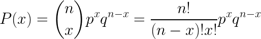

Where :
- `n = number of subjects` , 
- `x = the number of specified grades` , 
- `p = the probability of getting a grade`

### The following codes were used (output line breaks are omitted):

- We first import the data after collecting them:
  ```
  Q3_data <- read.csv("~./data/Q3_data.txt", sep="")
  View(Q3_data)
  rows = nrow(Q3_data)
  print(cat(rows, "rows of data imported."))
  ```
  > Output:
  > ```
  > 100 rows of data imported.NULL
  > ```

- We then get the frequencies (e.g. How many times does 'A' appear etc.) and the proportion of each data (e.g. What is 'A's appearance proportion)
  ```
  grades = Q3_data
  grades.freq = table(grades)
  grades.prob = grades.freq / rows
  ```

- We then output the frequency table of each grade occurence:
  ```
  cbind(grades.freq)
  ```
  > Output:
  > ```
  >   grades.freq
  > A          20
  > B          14
  > C          18
  > D          18
  > E          10
  > F          20
  > ```

- We define a universal function that takes 3 arguments to output the happenings' probability based on the binomial model.
  ```
  probs <- function(fromThis, chooseThis, thisSign){
    return(dbinom(chooseThis, size=fromThis, grades.prob[[thisSign]]))
  }
  ```
  Where:
  - [integer] `fromThis` is the number of trials being done.
  - [integer] `chooseThis` is the number of occurence of a particular grade.
  - [string] `thisSign` the grade to be tested.

- We then input the variables based on the problem requirements:
  - 4 of 9 subjects get `A`
    ```
    print(probs(9, 4, "A"))
    ```
    > Output:
    > ```
    > [1] 0.06606029
    > ```

  - 5 of 9 subjects get `B`
    ```
    print(probs(9, 5, "B"))
    ```
    > Output:
    > ```
    > [1] 0.003706846
    > ```

  - 3 of 9 subjects get `C`
    ```
    print(probs(9, 3, "C"))
    ```
    > Output:
    > ```
    > [1] 0.1489292
    > ```

  - 1 or 9 subjects get `D`
    ```
    print(probs(9, 1, "D"))
    ```
    > Output:
    > ```
    > [1] 0.3311508
    > ```

  ### Conclusion
  Therefore for this student:
  - The probability for `4 of 9` subjects getting `A` is `0.06606029`
  - The probability for `5 of 9` subjects getting `B` is `0.003706846`
  - The probability for `3 of 9` subjects getting `C` is `0.1489292`
  - The probability for `1 of 9` subjects getting `D` is `0.3311508`

---
## Question 4
This question presents problem for data analysis on the `Lunch money per week` of students.  
[This dataset](./src/data/Q4_data.txt) was used.
### The following codes were used (output line breaks are omitted):
- We first import the data:
  ```
  LunchMoneyPerWeek <- read.csv("./data/Q4_data.txt", sep="")
  View(LunchMoneyPerWeek)
  rows = nrow(LunchMoneyPerWeek)
  print(cat(rows, "rows of data imported."))
  ```
  > Output:
  > ```
  > 60 rows of data imported.NULL
  > ```

- We then calculate the mean and standard deviation:
  ```
  print("Mean = ")
  mean(myLMPW)
  print("Standard Deviation = ")
  sd(myLMPW)
  ```
  > Output:
  > ```
  > [1] "Mean = "
  > [1] 57.45
  > [1] "Standard Deviation = "
  > [1] 61.65498
  > ```

- Then, we output the frequency table and histogram:
  ```
  print("Frequency Table & Histogram")
  x = table(myLMPW)
  print(cbind(x))
  jpeg("../images/Q4_Histogram.jpg")
  barplot(x, main="Lunch Money per Week")
  ```
  > Output:
  > ```
  > [1] "Frequency Table & Histogram"
  >      x
  > 3    1
  > 4    1
  > 5    3
  > 15   3
  > 20   2
  > 25   7
  > 26   1
  > 28   1
  > 30   3
  > 35   3
  > 37   1
  > 40   1
  > 43   1
  > 50  10
  > 60   3
  > 70   5
  > 80   3
  > 91   1
  > 100  7
  > 105  1
  > 180  1
  > 450  1
  > ```
  > 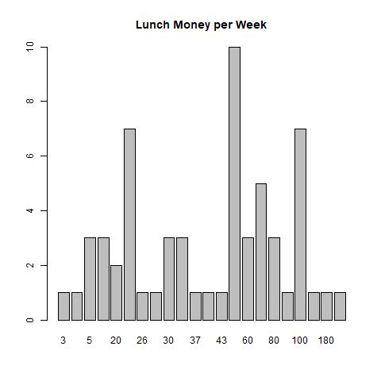

- The highest 20% of lunch money amount was then calculated:
  ```
  print("4)b)the highest 20% of lunch money amount = ")
  print("the lunch money amount of 12th students = RM ")
  th = LunchMoneyPerWeek$lunchMoney
  b = quantile(th, c(0.80))
  print(b[["80%"]])
  ```
  > Output:
  > ```
  > [1] "4)b)the highest 20% of lunch money amount = "
  > [1] "the lunch money amount of 12th students = RM "
  > [1] 80
  > ```

- The lunch money amount that a person has 30% chance of spending more was calculated:
  ```
  print("4)c)the lunch money amount that 30% chance of spending   more for lunchies in a week =  ")
  print("the lunch money amount of 18th student")
  print("Answer : RM")
  print(quantile(th, c(0.70))[["70%"]])
  ```
  > Output:
  > ```
  > [1] "4)c)the lunch money amount that 30% chance of spending   > more for lunchies in a week =  "
  >  lunchies in a week =  "
  > [1] "the lunch money amount of 18th student"
  > [1] "Answer : RM"
  > [1] 70
  > ```

- We then calculate the probability of spending for lunch within RM 5 from the mean:
  ```
  print("Normal Distribution")
  print("P(45.2 < x < 55.2) = ")
  print("1 - 2 X P(x < 45.2)")
  print("P(x < 45.2) = ")
  y = c(pnorm(45.2, mean = 50.2, sd = 30.58237, lower.tail =   TRUE))
  y
  z = 1-2*y
  print("ANSWER = ")
  z
  ```
  > Output:
  > ```
  > [1] "Normal Distribution"
  > [1] "P(45.2 < x < 55.2) = "
  > [1] "1 - 2 X P(x < 45.2)"
  > [1] "P(x < 45.2) = "
  > [1] 0.4350652
  > [1] "ANSWER = "
  > [1] 0.1298696
  > ```


---
## Question 5
Refer to [Q5 Report](./Q5_Report.md) for reporting style stuff.  

This question presents problems for data analysis on the Saving Habits of students in UTeM. [This dataset](./src/data/Q5_SavingHabit_cleaned.txt) was obtained via a Google Form with the questions as defined [here](./src/data/Q5_questionnaire.md).  
We will therefore be discussing the outputs and rationalle behind the commands used in the script.

### The following codes were used (output line breaks are omitted):
- We first import the dataset and view it:
  ```
  savingHabit <- read.delim("./data/Q5_SavingHabit_cleaned.txt")
  View(savingHabit)
  rows=nrow(savingHabit)
  ```
  > Output:
  > ```
  > 60 rows of data imported.NULL
  > ```

#### For Q5_2(a)

- We then calculate the frequencies of each column:
  - Gender
    ```
    gender.freq = table(savingHabit$Gender)
    print(cbind(gender.freq))
    ```
    > Output:
    > ```
    >        gender.freq
    > Female          28
    > Male            32
    > ```
  - Age
    ```
    age.freq = table(savingHabit$Age)
    print(cbind(age.freq))
    ```
    > Output:
    > ```
    >      age.freq
    > 19.5       24
    > 21.5       32
    > 24          4
    > ```
  - Faculty
    ```
    faculty.freq = table(savingHabit$Faculty)
    print(cbind(faculty.freq))
    ```
    > Output:
    > ```
    >       faculty.freq
    > FKE              8
    > FKM              4
    > FKP              3
    > FPTT             3
    > FTKEE            2
    > FTMK            40
    > ```
  - Financial Methods
    ```
    financialMethods.freq = table(savingHabit$FinancialMethods)
    print(cbind(financialMethods.freq))
    ```
    > Output:
    > ```
    >         financialMethods.freq
    > Others                      5
    > Parents                    16
    > PTPTN                      39
    > ```
  - Allowance
    ```
    allowance.freq = table(savingHabit$Allowance)
    print(cbind(allowance.freq))
    ```
    > Output:
    > ```
    >       allowance.freq
    > 100               31
    > 350.5             22
    > 650.5              7
    > ```
  - If student is taking a part time job:
    ```
    partTime.freq = table(savingHabit$PartTime)
    print(cbind(partTime.freq))
    ```
    > Output:
    > ```
    >     partTime.freq
    > No             50
    > Yes            10
    > ```
  - If a student has difficulty in managing money:
    ```
    MoneyMgmtDifficulty.freq = table(savingHabit$MoneyMgmtDifficulty)
    print(cbind(MoneyMgmtDifficulty.freq))
    ```
    > Output:
    > ```
    >   MoneyMgmtDifficulty.freq
    > 1                        4
    > 2                        7
    > 3                       25
    > 4                       16
    > 5                        8
    > ```
  - If the student has ability to prepare his/her own weekly/monthly budget:
    ```
    abilityPrepareBudget.freq = table(savingHabit$AbilityPrepareBudget)
    print(cbind(abilityPrepareBudget.freq))
    ```
    > Output:
    > ```
    >   abilityPrepareBudget.freq
    > 2                        13
    > 3                        27
    > 4                        11
    > 5                         9
    > ```
  - If the student's parents' are good examples when it comes to money management:
    ```
    parentsGoodExample.freq = table(savingHabit$ParentsGoodExample)
    print(cbind(parentsGoodExample.freq))
    ```
    > Output:
    > ```
    >   parentsGoodExample.freq
    > 2                       3
    > 3                      21
    > 4                      21
    > 5                      15
    > ```
  - If the student appreciate it when parents give advice about what to do with money:
    ```
    appreciateAdvice.freq = table(savingHabit$AppreciateAdvice)
    print(cbind(appreciateAdvice.freq))
    ```
    > Output:
    > ```
    >   appreciateAdvice.freq
    > 2                     1
    > 3                    16
    > 4                    23
    > 5                    20
    > ```
  - If friends do regularly save with savings account:
    ```
    friendsSaveRegularly.freq = table(savingHabit$FriendsSaveRegularly)
    print(cbind(friendsSaveRegularly.freq))
    ```
    > Output:
    > ```
    >   friendsSaveRegularly.freq
    > 1                         4
    > 2                        15
    > 3                        18
    > 4                        16
    > 5                         7
    > ```
  - If the student regularly discusses about money management issue (saving) with friends:
    ```
    discussWithFriends.freq = table(savingHabit$DiscussWithFriends)
    print(cbind(discussWithFriends.freq))
    ```
    > Output:
    > ```
    >   discussWithFriends.freq
    > 1                       7
    > 2                      19
    > 3                      23
    > 4                       8
    > 5                       3
    > ```
  - If "buy now, think later" describes them:
    ```
    buyNowThinkLater.freq = table(savingHabit$BuyNowThinkLater)
    print(cbind(buyNowThinkLater.freq))
    ```
    > Output:
    > ```
    >   buyNowThinkLater.freq
    > 1                    17
    > 2                    10
    > 3                    20
    > 4                     9
    > 5                     4
    > ```
  - If rarely achieve saving goals:
    ```
    rarelyAchieveGoal.freq = table(savingHabit$RarelyAchieveGoal)
    print(cbind(rarelyAchieveGoal.freq))
    ```
    > Output:
    > ```
    >   rarelyAchieveGoal.freq
    > 1                      3
    > 2                     12
    > 3                     25
    > 4                     15
    > 5                      5
    > ```
  - If put money aside on a regular basis for the future:
    ```
    putMoneyAside.freq = table(savingHabit$PutMoneyAside)
    print(cbind(putMoneyAside.freq))
    ```
    > Output:
    > ```
    >   putMoneyAside.freq
    > 1                  5
    > 2                  2
    > 3                 27
    > 4                 21
    > 5                  5
    > ```
  - If often compare prices before making a purchase:
    ```
    comparePrices.freq = table(savingHabit$ComparePrices)
    print(cbind(comparePrices.freq))
    ```
    > Output:
    > ```
    >   comparePrices.freq
    > 2                  5
    > 3                 14
    > 4                 21
    > 5                 20
    > ```

- We then calculate the relative frequencies of each column:
  - Gender
    ```
    gender.relFreq = table(savingHabit$Gender) / rows
    print(cbind(gender.relFreq))
    ```
    > Output:
    > ```
    >        gender.relFreq
    > Female      0.4666667
    > Male        0.5333333
    > ```
  - Age
    ```
    age.relFreq = table(savingHabit$Age) / rows
    print(cbind(age.relFreq))
    ```
    > Output:
    > ```
    >      age.relFreq
    > 19.5  0.40000000
    > 21.5  0.53333333
    > 24    0.06666667
    > ```
  - Faculty
    ```
    faculty.relFreq = table(savingHabit$Faculty) / rows
    print(cbind(faculty.relFreq))
    ```
    > Output:
    > ```
    >       faculty.relFreq
    > FKE        0.13333333
    > FKM        0.06666667
    > FKP        0.05000000
    > FPTT       0.05000000
    > FTKEE      0.03333333
    > FTMK       0.66666667
    > ```
  - Financial Methods
    ```
    financialMethods.relFreq = table(savingHabit$FinancialMethods) / rows
    print(cbind(financialMethods.relFreq))
    ```
    > Output:
    > ```
    >         financialMethods.relFreq
    > Others                0.08333333
    > Parents               0.26666667
    > PTPTN                 0.65000000
    > ```
  - Allowance
    ```
    allowance.relFreq = table(savingHabit$Allowance) / rows
    print(cbind(allowance.relFreq))
    ```
    > Output:
    > ```
    >       allowance.relFreq
    > 100           0.5166667
    > 350.5         0.3666667
    > 650.5         0.1166667
    > ```
  - If student is taking a part time job:
    ```
    partTime.relFreq = table(savingHabit$PartTime) / rows
    print(cbind(partTime.relFreq))
    ```
    > Output:
    > ```
    >     partTime.relFreq
    > No         0.8333333
    > Yes        0.1666667
    > ```
  - If a student has difficulty in managing money:
    ```
    MoneyMgmtDifficulty.relFreq = table(savingHabit$MoneyMgmtDifficulty) / rows
    print(cbind(MoneyMgmtDifficulty.relFreq))
    ```
    > Output:
    > ```
    >   MoneyMgmtDifficulty.relFreq
    > 1                  0.06666667
    > 2                  0.11666667
    > 3                  0.41666667
    > 4                  0.26666667
    > 5                  0.13333333
    > ```
  - If the student has ability to prepare his/her own weekly/monthly budget:
    ```
    abilityPrepareBudget.relFreq = table(savingHabit$AbilityPrepareBudget) / rows
    print(cbind(abilityPrepareBudget.relFreq))
    ```
    > Output:
    > ```
    >   abilityPrepareBudget.relFreq
    > 2                    0.2166667
    > 3                    0.4500000
    > 4                    0.1833333
    > 5                    0.1500000
    > ```
  - If the student's parents' are good examples when it comes to money management:
    ```
    parentsGoodExample.relFreq = table(savingHabit$ParentsGoodExample) / rows
    print(cbind(parentsGoodExample.relFreq))
    ```
    > Output:
    > ```
    >   parentsGoodExample.relFreq
    > 2                       0.05
    > 3                       0.35
    > 4                       0.35
    > 5                       0.25
    > ```
  - If the student appreciate it when parents give advice about what to do with money:
    ```
    appreciateAdvice.relFreq = table(savingHabit$AppreciateAdvice) / rows
    print(cbind(appreciateAdvice.relFreq))
    ```
    > Output:
    > ```
    >   appreciateAdvice.relFreq
    > 2               0.01666667
    > 3               0.26666667
    > 4               0.38333333
    > 5               0.33333333
    > ```
  - If friends do regularly save with savings account:
    ```
    friendsSaveRegularly.relFreq = table(savingHabit$FriendsSaveRegularly) / rows
    print(cbind(friendsSaveRegularly.relFreq))
    ```
    > Output:
    > ```
    >   friendsSaveRegularly.relFreq
    > 1                   0.06666667
    > 2                   0.25000000
    > 3                   0.30000000
    > 4                   0.26666667
    > 5                   0.11666667
    > ```
  - If the student regularly discusses about money management issue (saving) with friends:
    ```
    discussWithFriends.relFreq = table(savingHabit$DiscussWithFriends) / rows
    print(cbind(discussWithFriends.relFreq))
    ```
    > Output:
    > ```
    >   discussWithFriends.relFreq
    > 1                  0.1166667
    > 2                  0.3166667
    > 3                  0.3833333
    > 4                  0.1333333
    > 5                  0.0500000
    > ```
  - If "buy now, think later" describes them:
    ```
    buyNowThinkLater.relFreq = table(savingHabit$BuyNowThinkLater) / rows
    print(cbind(buyNowThinkLater.relFreq))
    ```
    > Output:
    > ```
    >   buyNowThinkLater.relFreq
    > 1               0.28333333
    > 2               0.16666667
    > 3               0.33333333
    > 4               0.15000000
    > 5               0.06666667
    > ```
  - If rarely achieve saving goals:
    ```
    rarelyAchieveGoal.relFreq = table(savingHabit$RarelyAchieveGoal) / rows
    print(cbind(rarelyAchieveGoal.relFreq))
    ```
    > Output:
    > ```
    >   rarelyAchieveGoal.relFreq
    > 1                0.05000000
    > 2                0.20000000
    > 3                0.41666667
    > 4                0.25000000
    > 5                0.08333333
    > ```
  - If put money aside on a regular basis for the future:
    ```
    putMoneyAside.relFreq = table(savingHabit$PutMoneyAside) / rows
    print(cbind(putMoneyAside.relFreq))
    ```
    > Output:
    > ```
    >   putMoneyAside.relFreq
    > 1            0.08333333
    > 2            0.03333333
    > 3            0.45000000
    > 4            0.35000000
    > 5            0.08333333
    > ```
  - If often compare prices before making a purchase:
    ```
    comparePrices.relFreq = table(savingHabit$ComparePrices) / rows
    print(cbind(comparePrices.relFreq))
    ```
    > Output:
    > ```
    >   comparePrices.relFreq
    > 2            0.08333333
    > 3            0.23333333
    > 4            0.35000000
    > 5            0.33333333
    > ```

- We then calculate the percentage distribution of each column:
  - Gender
    ```
    gender.percentageDist = gender.relFreq * 100
    print(cbind(gender.percentageDist))
    ```
    > Output:
    > ```
    >        gender.percentageDist
    > Female              46.66667
    > Male                53.33333
    > ```
  - Age
    ```
    age.percentageDist = age.relFreq * 100
    print(cbind(age.percentageDist))
    ```
    > Output:
    > ```
    >      age.percentageDist
    > 19.5          40.000000
    > 21.5          53.333333
    > 24             6.666667
    > ```
  - Faculty
    ```
    faculty.percentageDist = faculty.relFreq * 100
    print(cbind(faculty.percentageDist))
    ```
    > Output:
    > ```
    >       faculty.percentageDist
    > FKE                13.333333
    > FKM                 6.666667
    > FKP                 5.000000
    > FPTT                5.000000
    > FTKEE               3.333333
    > FTMK               66.666667
    > ```
  - Financial Methods
    ```
    financialMethods.percentageDist = financialMethods.relFreq * 100
    print(cbind(financialMethods.percentageDist))
    ```
    > Output:
    > ```
    >         financialMethods.percentageDist
    > Others                         8.333333
    > Parents                       26.666667
    > PTPTN                         65.000000
    > ```
  - Allowance
    ```
    allowance.percentageDist = allowance.relFreq * 100
    print(cbind(allowance.percentageDist))
    ```
    > Output:
    > ```
    >       allowance.percentageDist
    > 100                   51.66667
    > 350.5                 36.66667
    > 650.5                 11.66667
    > ```
  - If student is taking a part time job:
    ```
    partTime.percentageDist = partTime.relFreq * 100
    print(cbind(partTime.percentageDist))
    ```
    > Output:
    > ```
    >     partTime.percentageDist
    > No                 83.33333
    > Yes                16.66667
    > ```
  - If a student has difficulty in managing money:
    ```
    MoneyMgmtDifficulty.percentageDist = MoneyMgmtDifficulty.relFreq * 100
    print(cbind(MoneyMgmtDifficulty.percentageDist))
    ```
    > Output:
    > ```
    >   MoneyMgmtDifficulty.percentageDist
    > 1                           6.666667
    > 2                          11.666667
    > 3                          41.666667
    > 4                          26.666667
    > 5                          13.333333
    > ```
  - If the student has ability to prepare his/her own weekly/monthly budget:
    ```
    abilityPrepareBudget.percentageDist = abilityPrepareBudget.relFreq * 100
    print(cbind(abilityPrepareBudget.percentageDist))
    ```
    > Output:
    > ```
    >   abilityPrepareBudget.percentageDist
    > 2                            21.66667
    > 3                            45.00000
    > 4                            18.33333
    > 5                            15.00000
    > ```
  - If the student's parents' are good examples when it comes to money management:
    ```
    parentsGoodExample.percentageDist = parentsGoodExample.relFreq * 100
    print(cbind(parentsGoodExample.percentageDist))
    ```
    > Output:
    > ```
    >   parentsGoodExample.percentageDist
    > 2                                 5
    > 3                                35
    > 4                                35
    > 5                                25
    > ```
  - If the student appreciate it when parents give advice about what to do with money:
    ```
    appreciateAdvice.percentageDist = appreciateAdvice.relFreq * 100
    print(cbind(appreciateAdvice.percentageDist))
    ```
    > Output:
    > ```
    >   appreciateAdvice.percentageDist
    > 2                        1.666667
    > 3                       26.666667
    > 4                       38.333333
    > 5                       33.333333
    > ```
  - If friends do regularly save with savings account:
    ```
    friendsSaveRegularly.percentageDist = friendsSaveRegularly.relFreq * 100
    print(cbind(friendsSaveRegularly.percentageDist))
    ```
    > Output:
    > ```
    >   friendsSaveRegularly.percentageDist
    > 1                            6.666667
    > 2                           25.000000
    > 3                           30.000000
    > 4                           26.666667
    > 5                           11.666667
    > ```
  - If the student regularly discusses about money management issue (saving) with friends:
    ```
    discussWithFriends.percentageDist = discussWithFriends.relFreq * 100
    print(cbind(discussWithFriends.percentageDist))
    ```
    > Output:
    > ```
    >   discussWithFriends.percentageDist
    > 1                          11.66667
    > 2                          31.66667
    > 3                          38.33333
    > 4                          13.33333
    > 5                           5.00000
    > ```
  - If "buy now, think later" describes them:
    ```
    buyNowThinkLater.percentageDist = buyNowThinkLater.relFreq * 100
    print(cbind(buyNowThinkLater.percentageDist))
    ```
    > Output:
    > ```
    >   buyNowThinkLater.percentageDist
    > 1                       28.333333
    > 2                       16.666667
    > 3                       33.333333
    > 4                       15.000000
    > 5                        6.666667
    > ```
  - If rarely achieve saving goals:
    ```
    rarelyAchieveGoal.percentageDist = rarelyAchieveGoal.relFreq * 100
    print(cbind(rarelyAchieveGoal.percentageDist))
    ```
    > Output:
    > ```
    >   rarelyAchieveGoal.percentageDist
    > 1                         5.000000
    > 2                        20.000000
    > 3                        41.666667
    > 4                        25.000000
    > 5                         8.333333
    > ```
  - If put money aside on a regular basis for the future:
    ```
    putMoneyAside.percentageDist = putMoneyAside.relFreq * 100
    print(cbind(putMoneyAside.percentageDist))
    ```
    > Output:
    > ```
    >   putMoneyAside.percentageDist
    > 1                     8.333333
    > 2                     3.333333
    > 3                    45.000000
    > 4                    35.000000
    > 5                     8.333333
    > ```
  - If often compare prices before making a purchase:
    ```
    comparePrices.percentageDist = comparePrices.relFreq * 100
    print(cbind(comparePrices.percentageDist))
    ```
    > Output:
    > ```
    >   comparePrices.percentageDist
    > 2                     8.333333
    > 3                    23.333333
    > 4                    35.000000
    > 5                    33.333333
    > ```

- We then generate the bar chart based on the frequencies:
  - Gender
    ```
    jpeg("../images/Q5_Bar-Gender.jpg")
    barplot(gender.freq, main = "Frequency of Gender")
    dev.off()
    ```
    > Output:  
    > 
  - Age
    ```
    jpeg("../images/Q5_Bar-age.jpg")
    barplot(age.freq, main = "Frequency of Age (Midpoint of bins)")
    dev.off()
    ```
    > Output:  
    > 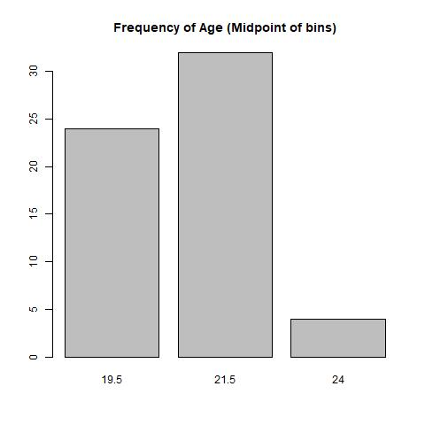
  - Faculty
    ```
    jpeg("../images/Q5_Bar-faculty.jpg")
    barplot(faculty.freq, main = "Frequency of Faculty")
    dev.off()
    ```
    > Output:  
    > 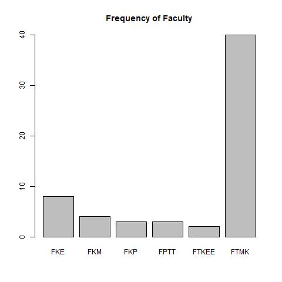
  - Financial Methods
    ```
    jpeg("../images/Q5_Bar-financialMethods.jpg")
    barplot(financialMethods.freq, main = "Frequency of Financial Mehtods")
    dev.off()
    ```
    > Output:
    > 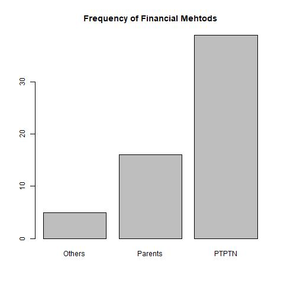
  - Allowance
    ```
    jpeg("../images/Q5_Bar-allowance.jpg")
    barplot(allowance.freq, main = "Frequency of Allowance (Midpoint of bins)")
    dev.off()
    ```
    > Output:  
    > 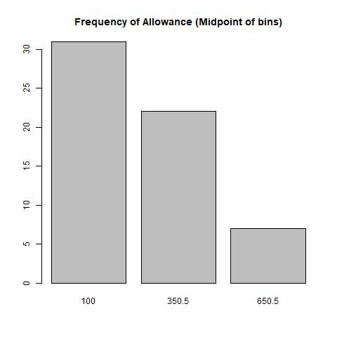
  - If student is taking a part time job:
    ```
    jpeg("../images/Q5_Bar-partTime.jpg")
    barplot(partTime.freq, main = "Frequency of Part Time Job engagement")
    dev.off()
    ```
    > Output:  
    > 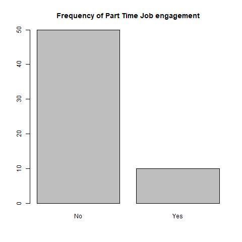
  - If a student has difficulty in managing money:
    ```
    jpeg("../images/Q5_Bar-MoneyMgmtDifficulty.jpg")
    barplot(MoneyMgmtDifficulty.freq, main = "Frequency of money management difficulty rating")
    dev.off()
    ```
    > Output:  
    > 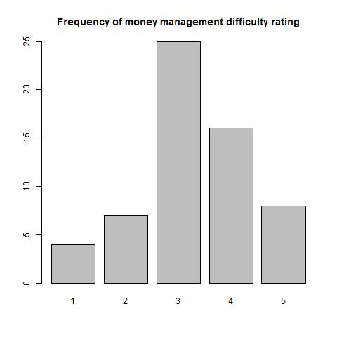
  - If the student has ability to prepare his/her own weekly/monthly budget:
    ```
    jpeg("../images/Q5_Bar-abilityPrepareBudget.jpg")
    barplot(abilityPrepareBudget.freq, main = "Frequency of budget preparing ability rating")
    dev.off()
    ```
    > Output:  
    > 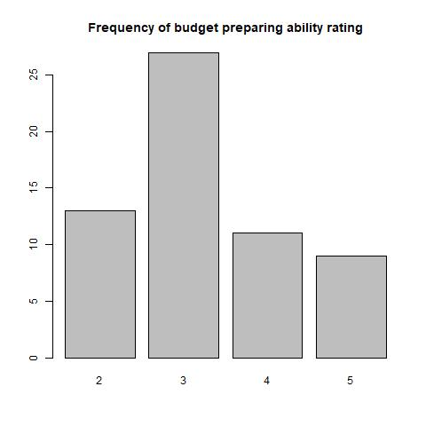
  - If the student's parents' are good examples when it comes to money management:
    ```
    jpeg("../images/Q5_Bar-parentsGoodExample.jpg")
    barplot(parentsGoodExample.freq, main = "Frequency of if parents are good example rating")
    dev.off()
    ```
    > Output:  
    > 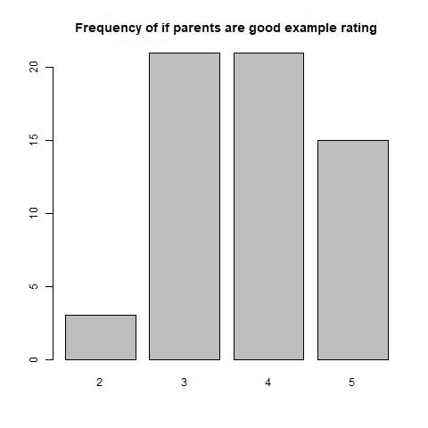
  - If the student appreciate it when parents give advice about what to do with money:
    ```
    jpeg("../images/Q5_Bar-appreciateAdvice.jpg")
    barplot(appreciateAdvice.freq, main = "Frequency of parents' advice appreciation rating")
    dev.off()
    ```
    > Output:  
    > 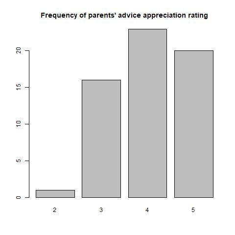
  - If friends do regularly save with savings account:
    ```
    jpeg("../images/Q5_Bar-friendsSaveRegularly.jpg")
    barplot(friendsSaveRegularly.freq, main = "Frequency of if friends save regularly rating")
    dev.off()
    ```
    > Output:  
    > 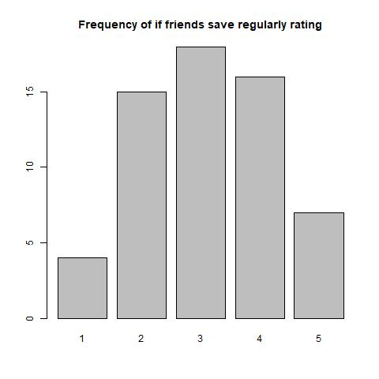
  - If the student regularly discusses about money management issue (saving) with friends:
    ```
    jpeg("../images/Q5_Bar-discussWithFriends.jpg")
    barplot(discussWithFriends.freq, main = "Frequency of if discuss savings with friends rating")
    dev.off()
    ```
    > Output:  
    > 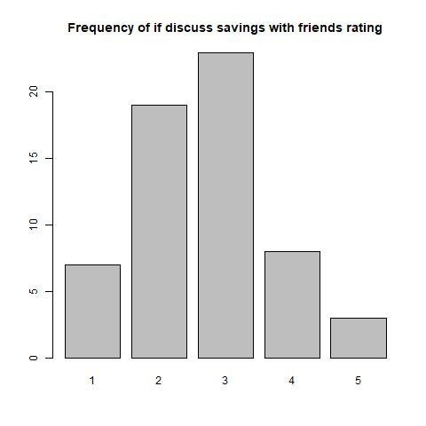
  - If "buy now, think later" describes them:
    ```
    jpeg("../images/Q5_Bar-buyNowThinkLater.jpg")
    barplot(buyNowThinkLater.freq, main = "Frequency of buy now think later rating")
    dev.off()
    ```
    > Output:  
    > 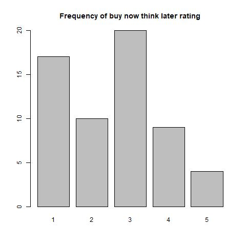
  - If rarely achieve saving goals:
    ```
    jpeg("../images/Q5_Bar-rarelyAchieveGoal.jpg")
    barplot(rarelyAchieveGoal.freq, main = "Frequency of rarely achieving goal rating")
    dev.off()
    ```
    > Output:  
    > 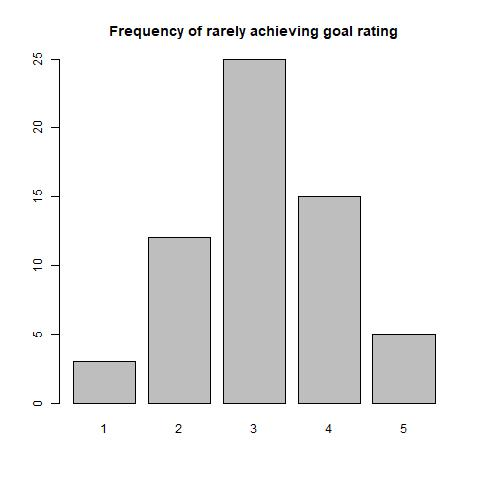
  - If put money aside on a regular basis for the future:
    ```
    jpeg("../images/Q5_Bar-putMoneyAside.jpg")
    barplot(putMoneyAside.freq, main = "Frequency of putting money aside rating")
    dev.off()
    ```
    > Output:  
    > 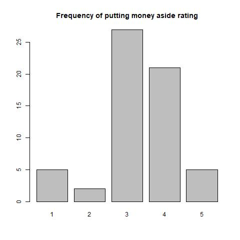
  - If often compare prices before making a purchase:
    ```
    jpeg("../images/Q5_Bar-comparePrices.jpg")
    barplot(comparePrices.freq, main = "Frequency of compare prices before making purchases rating")
    dev.off()
    ```
    > Output:  
    > 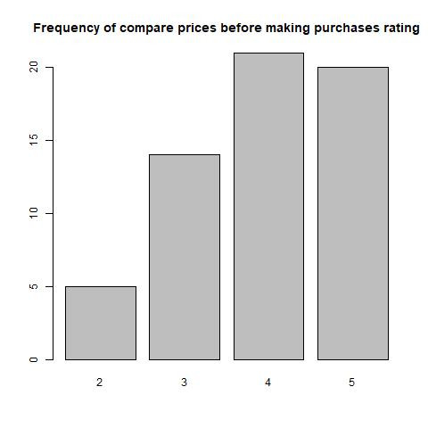

- We then generate pie charts based on the percentage distribution:
  - Gender
    ```
    jpeg("../images/Q5_Pie-gender.jpg")
    pie(gender.percentageDist, main="Percentage Distribution of Gender")
    dev.off()
    ```
    > Output:  
    > 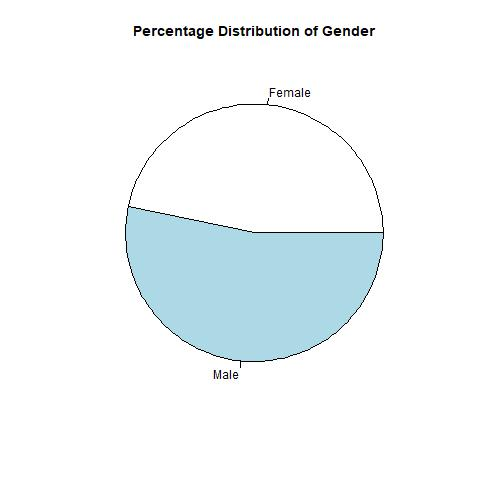
  - Age
    ```
    jpeg("../images/Q5_Pie-age.jpg")
    pie(age.percentageDist, main="Percentage Distribution of Age (Midpoint of bins)")
    dev.off()
    ```
    > Output:  
    > 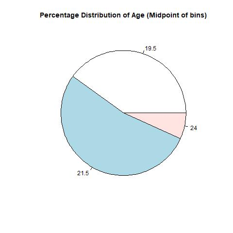
  - Faculty
    ```
    jpeg("../images/Q5_Pie-faculty.jpg")
    pie(faculty.percentageDist, main="Percentage Distribution of Faculty")
    dev.off()
    ```
    > Output:  
    > 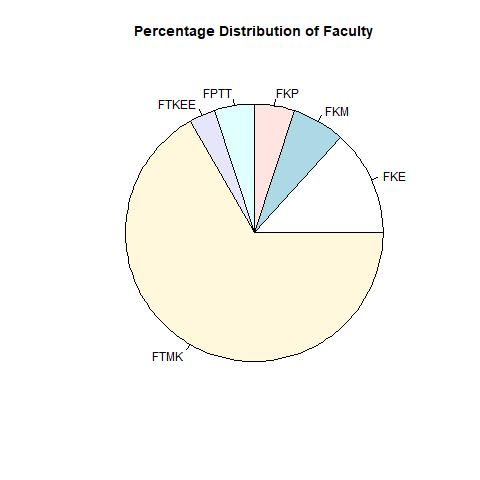
  - Financial Methods
    ```
    jpeg("../images/Q5_Pie-financialMethods.jpg")
    pie(financialMethods.percentageDist, main="Percentage Distribution of Financial Methods")
    dev.off()
    ```
    > Output:  
    > 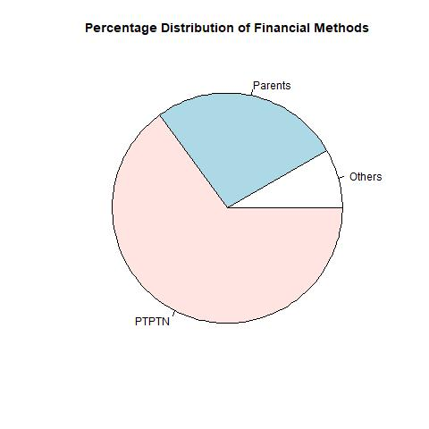
  - Allowance
    ```
    jpeg("../images/Q5_Pie-allowance.jpg")
    pie(allowance.percentageDist, main="Percentage Distribution of Allowance (Midpoint of bins)")
    dev.off()
    ```
    > Output:  
    > 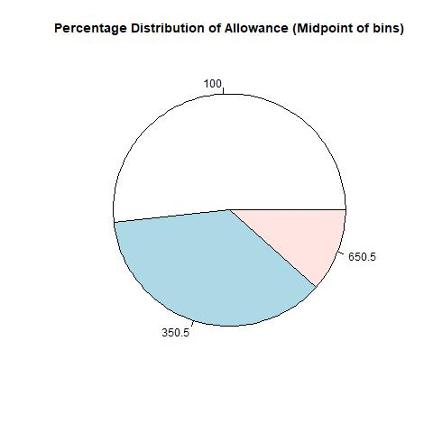
  - If student is taking a part time job:
    ```
    jpeg("../images/Q5_Pie-partTime.jpg")
    pie(partTime.percentageDist, main="Percentage Distribution of Part Time Job engagement")
    dev.off()
    ```
    > Output:  
    > 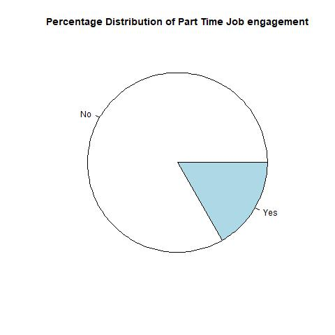
  - If a student has difficulty in managing money:
    ```
    jpeg("../images/Q5_Pie-MoneyMgmtDifficulty.jpg")
    pie(MoneyMgmtDifficulty.percentageDist, main="Percentage Distribution of money management difficulty rating")
    dev.off()
    ```
    > Output:  
    > 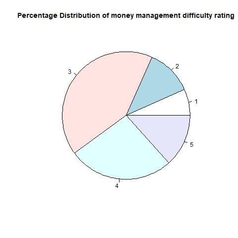
  - If the student has ability to prepare his/her own weekly/monthly budget:
    ```
    jpeg("../images/Q5_Pie-abilityPrepareBudget.jpg")
    pie(abilityPrepareBudget.percentageDist, main="Percentage Distribution of budget preparing ability rating")
    dev.off()
    ```
    > Output:  
    > 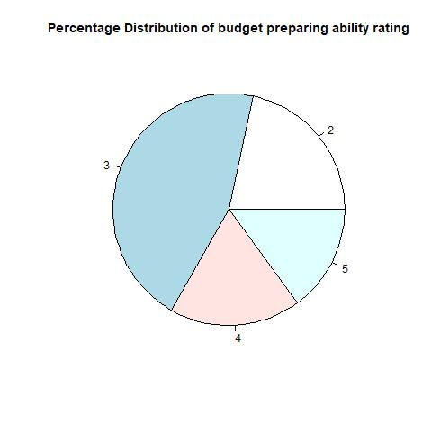
  - If the student's parents' are good examples when it comes to money management:
    ```
    jpeg("../images/Q5_Pie-parentsGoodExample.jpg")
    pie(parentsGoodExample.percentageDist, main="Percentage Distribution of if parents are good example rating")
    dev.off()
    ```
    > Output:  
    > 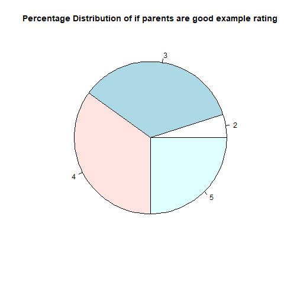
  - If the student appreciate it when parents give advice about what to do with money:
    ```
    jpeg("../images/Q5_Pie-appreciateAdvice.jpg")
    pie(appreciateAdvice.percentageDist, main="Percentage Distribution of parents' advice appreciation rating")
    dev.off()
    ```
    > Output:  
    > 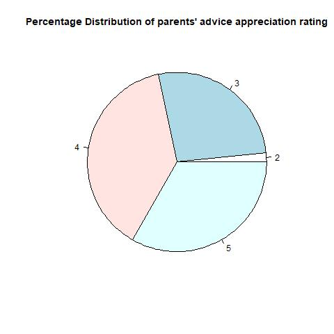
  - If friends do regularly save with savings account:
    ```
    jpeg("../images/Q5_Pie-friendsSaveRegularly.jpg")
    pie(friendsSaveRegularly.percentageDist, main="Percentage Distribution of if friends save regularly rating")
    dev.off()
    ```
    > Output:  
    > 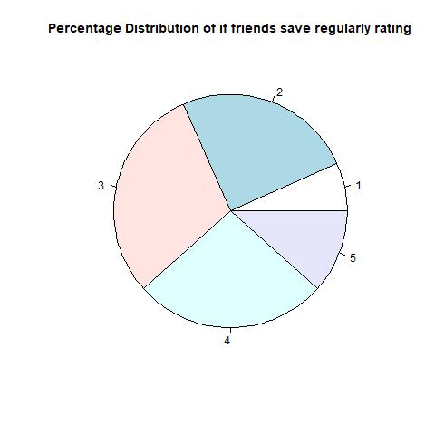
  - If the student regularly discusses about money management issue (saving) with friends:
    ```
    jpeg("../images/Q5_Pie-discussWithFriends.jpg")
    pie(discussWithFriends.percentageDist, main="Percentage Distribution of if discuss savings with friends rating")
    dev.off()
    ```
    > Output:  
    > 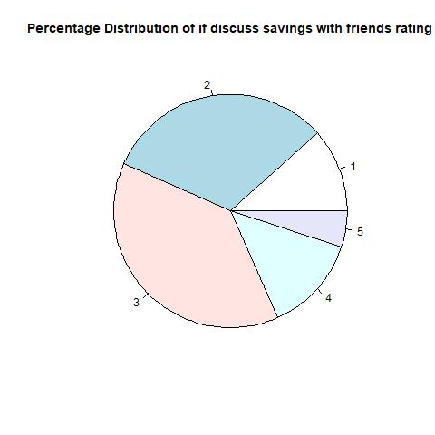
  - If "buy now, think later" describes them:
    ```
    jpeg("../images/Q5_Pie-buyNowThinkLater.jpg")
    pie(buyNowThinkLater.percentageDist, main="Percentage Distribution of buy now think later rating")
    dev.off()
    ```
    > Output:  
    > 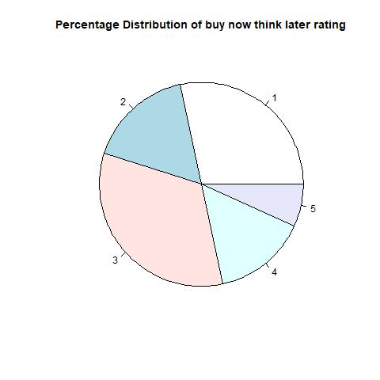
  - If rarely achieve saving goals:
    ```
    jpeg("../images/Q5_Pie-rarelyAchieveGoal.jpg")
    pie(rarelyAchieveGoal.percentageDist, main="Percentage Distribution of rarely achieving goal rating")
    dev.off()
    ```
    > Output:  
    > 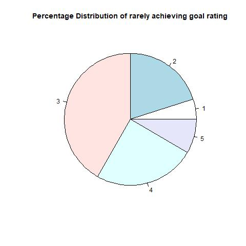
  - If put money aside on a regular basis for the future:
    ```
    jpeg("../images/Q5_Pie-putMoneyAside.jpg")
    pie(putMoneyAside.percentageDist, main="Percentage Distribution of putting money aside rating")
    dev.off()
    ```
    > Output:  
    > 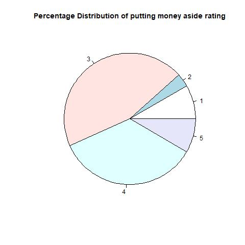
  - If often compare prices before making a purchase:
    ```
    jpeg("../images/Q5_Pie-comparePrices.jpg")
    pie(comparePrices.percentageDist, main="Percentage Distribution of compare prices before making purchases rating")
    dev.off()
    ```
    > Output:  
    > 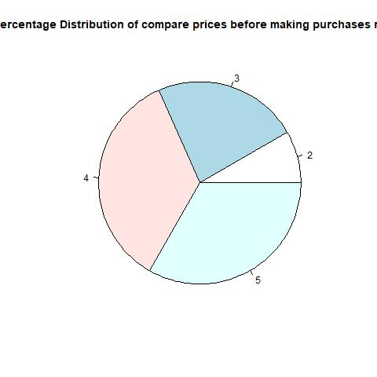

#### For Q5_2(b)
- We first import the required libraries:
  ```
  library(ggplot2)
  library(dplyr)
  ```

- We get the central tendancy mean of each of the variables:
  - Financial Influences
    ```
    financialInfluences = (savingHabit$MoneyMgmtDifficulty + savingHabit$AbilityPrepareBudget)/2
    print(financialInfluences)
    ```
    > Output:
    > ```
    > [1] 4.5 3.0 3.0 3.5 3.0 3.0 3.0 3.5 2.5 3.0
    > [11] 1.5 2.5 3.0 5.0 3.0 4.0 3.5 2.5 2.0 3.0
    > [21] 4.0 4.5 3.5 3.5 3.0 3.0 3.0 3.0 3.0 3.0
    > [31] 2.0 3.5 2.5 3.0 2.5 5.0 3.5 3.0 3.0 2.5
    > [41] 3.0 1.5 4.0 4.0 3.5 3.0 3.5 4.0 4.0 3.0
    > [51] 4.0 4.5 4.5 5.0 4.0 4.0 2.0 3.0 3.0 3.0
    > ```
  - Parents' Influences
    ```
    parentsInfluences = (savingHabit$ParentsGoodExample + savingHabit$AppreciateAdvice)/2
    print(parentsInfluences)
    ```
    > Output:
    > ```
    >  [1] 4.5 3.0 4.0 3.5 3.5 3.5 3.0 5.0 3.0 5.0
    > [11] 5.0 3.0 3.5 5.0 4.0 4.0 4.0 5.0 4.0 4.0
    > [21] 3.0 3.5 5.0 3.5 3.0 3.0 4.0 3.5 5.0 3.0
    > [31] 4.0 3.0 4.5 3.5 2.0 4.0 4.5 4.5 5.0 4.0
    > [41] 3.5 2.5 4.5 4.5 4.5 3.0 3.0 4.5 3.5 5.0
    > [51] 4.5 5.0 5.0 5.0 3.0 5.0 3.5 4.0 3.0 3.5
    > ```
  - Peer Influences
    ```
    peerInfluences = (savingHabit$FriendsSaveRegularly + savingHabit$DiscussWithFriends)/2
    print(peerInfluences)
    ```
    > Output:
    > ```
    >  [1] 2.0 3.0 3.0 2.5 2.0 2.0 2.0 1.5 3.0 2.5
    > [11] 2.5 3.0 3.5 4.5 3.0 2.0 3.0 3.0 3.0 3.5
    > [21] 3.0 4.0 3.5 3.0 3.0 3.0 1.5 3.5 1.5 3.0
    > [31] 3.5 3.0 2.0 3.5 2.5 3.0 3.0 3.5 1.5 2.0
    > [41] 3.0 3.0 3.5 2.0 3.5 3.0 3.0 4.0 3.0 4.5
    > [51] 1.0 4.5 5.0 2.5 2.5 4.0 3.0 3.0 3.0 2.0
    > ```
  - Self-Control Influences
    ```
    selfcontrolInfluences = (savingHabit$BuyNowThinkLater + savingHabit$RarelyAchieveGoal)/2
    print(selfcontrolInfluences)
    ```
    > Output:
    > ```
    >  [1] 1.5 3.0 4.0 2.5 2.0 3.5 2.5 3.0 4.0 3.5
    > [11] 2.5 3.5 3.0 3.0 3.0 2.5 2.5 5.0 2.5 2.5
    > [21] 3.0 2.0 2.0 1.5 3.0 2.0 1.0 1.5 1.0 3.0
    > [31] 3.0 2.0 2.5 3.0 3.0 1.5 3.5 3.0 4.5 2.5
    > [41] 3.0 4.0 2.0 4.0 3.5 3.0 3.0 4.0 2.5 3.0
    > [51] 3.0 5.0 2.5 1.5 3.0 1.0 4.5 4.0 3.0 2.5
    > ```
  - Saving Attitude Influences
    ```
    savingAttitude = (savingHabit$PutMoneyAside + savingHabit$ComparePrices)/2
    print(savingAttitude)
    ```
    > Output:
    > ```
    >  [1] 4.5 3.0 4.5 3.5 4.0 4.0 4.0 3.0 2.5 1.5
    > [11] 2.5 3.0 3.0 4.5 4.0 3.0 4.0 4.5 3.5 4.0
    > [21] 4.0 3.5 4.0 3.5 3.0 3.0 3.0 4.5 2.5 3.0
    > [31] 3.5 4.0 4.0 4.0 3.0 4.5 4.0 5.0 4.0 4.0
    > [41] 4.0 4.0 4.0 3.0 4.0 3.0 2.5 4.0 3.0 4.5
    > [51] 5.0 5.0 4.0 4.0 3.0 3.0 2.5 4.0 3.0 3.5
    > ```

- We plot the graph for `Gender` against each of the variables:
  - Financial Influences
    ```
    jpeg("../images/Q5_Plot-Gender_MoneyMgmtDifficulty.jpg")
      qplot(x = savingHabit$Gender, y = savingHabit$MoneyMgmtDifficulty,
        geom = "boxplot", data = savingHabit,
        xlab = "Gender", 
        ylab = "Money Management Difficulty",
        fill = I("lightblue"))
      dev.off()
    ```
    > Output:
    > 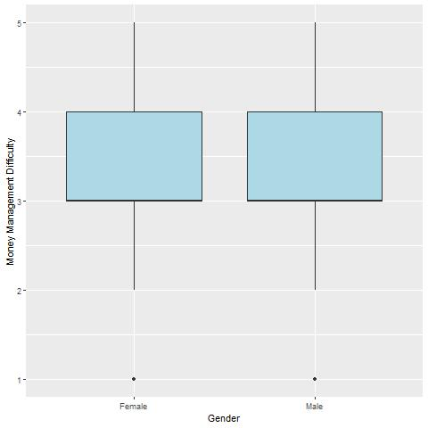
  - Parents' Influences
    ```
    jpeg("../images/Q5_Plot-Gender_ParentsGoodExample.jpg")
      qplot(x = savingHabit$Gender, y = savingHabit$ParentsGoodExample,
        geom = "boxplot", data = savingHabit,
        xlab = "Gender", 
        ylab = "Parents Good Example",
        fill = I("lightblue"))
      dev.off()
    ```
    > Output:
    > 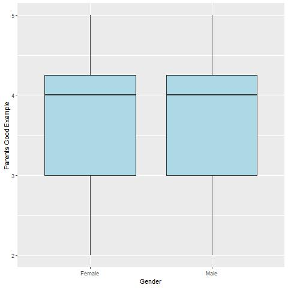
  - Peer Influences
    ```
    jpeg("../images/Q5_Plot-Gender_DiscussWithFriends.jpg")
      qplot(x = savingHabit$Gender, y = savingHabit$DiscussWithFriends,
        geom = "boxplot", data = savingHabit,
        xlab = "Gender", 
        ylab = "Discuss With Friends",
        fill = I("lightblue"))
      dev.off()
    ```
    > Output:
    > 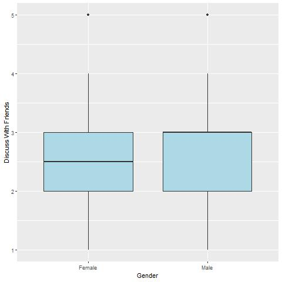
  - Self-Control Influences
    ```
    jpeg("../images/Q5_Plot-Gender_BuyNowThinkLater.jpg")
      qplot(x = savingHabit$Gender, y = savingHabit$BuyNowThinkLater,
        geom = "boxplot", data = savingHabit,
        xlab = "Gender", 
        ylab = "Buy Now Think Later",
        fill = I("lightblue"))
      dev.off()
    ```
    > Output:
    > 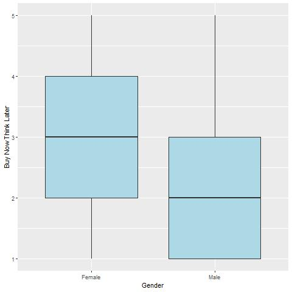
  - Saving Attitude Influences
    ```
    jpeg("../images/Q5_Plot-Gender_PutMoneyAside.jpg")
      qplot(x = savingHabit$Gender, y = savingHabit$PutMoneyAside,
        geom = "boxplot", data = savingHabit,
        xlab = "Gender", 
        ylab = "Put Money Aside",
        fill = I("lightblue"))
      dev.off()
    ```
    > Output:
    > 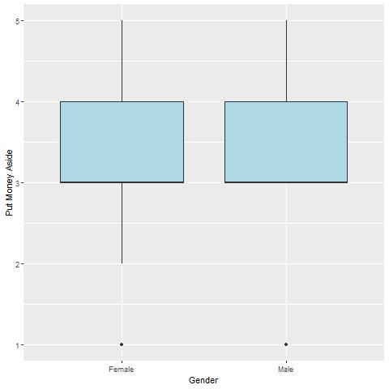

- Then, the t-test was done for all variables for `gender`:
  - Financial
    ```
    genderFinancial <- t.test(financialInfluences ~ savingHabit$Gender, data = savingHabit)
    print(genderFinancial)
    ```
    > Output:
    > ```
    > 	Welch Two Sample t-test
    > 
    > data:  financialInfluences by savingHabit$Gender
    > t = -0.8883, df = 57.75, p-value = 0.3781
    > alternative hypothesis: true difference in means is not equal to 0
    > 95 percent confidence interval:
    >  -0.5882672  0.2266600
    > sample estimates:
    > mean in group Female   mean in group Male 
    >             3.178571             3.359375
    > ```
  - Parents
    ```
    genderParents <- t.test(parentsInfluences ~ savingHabit$Gender, data = savingHabit)
    print(genderParents)
    ```
    > Output:
    > ```
    > 	Welch Two Sample t-test
    > 
    > data:  parentsInfluences by savingHabit$Gender
    > t = -0.70053, df = 55.504, p-value =
    > 0.4865
    > alternative hypothesis: true difference in means is not equal to 0
    > 95 percent confidence interval:
    >  -0.5600676  0.2698890
    > sample estimates:
    > mean in group Female   mean in group Male 
    >             3.839286             3.984375 
    > ```
  - Peer
    ```
    genderPeer <- t.test(peerInfluences ~ savingHabit$Gender, data = savingHabit)
    print(genderPeer)
    ```
    > Output:
    > ```
    > 	Welch Two Sample t-test
    > 
    > data:  peerInfluences by savingHabit$Gender
    > t = 0.094828, df = 57.009, p-value =
    > 0.9248
    > alternative hypothesis: true difference in means is not equal to 0
    > 95 percent confidence interval:
    >  -0.4041317  0.4443102
    > sample estimates:
    > mean in group Female   mean in group Male 
    >             2.910714             2.890625 
    > ```
  - Self-Control
    ```
    genderSelfControl <- t.test( selfcontrolInfluences ~ savingHabit$Gender, data = savingHabit)
    print(genderSelfControl)
    ```
    > Output:
    > ```
    > 	Welch Two Sample t-test
    > 
    > data:  selfcontrolInfluences by savingHabit$Gender
    > t = 1.1748, df = 57.546, p-value = 0.2449
    > alternative hypothesis: true difference in means is not equal to 0
    > 95 percent confidence interval:
    >  -0.1964812  0.7545169
    > sample estimates:
    > mean in group Female   mean in group Male 
    >             2.982143             2.703125 
    > ```
  - Saving Attitude
    ```
    genderSaving <- t.test(savingAttitude ~ savingHabit$Gender, data = savingHabit)
    print(genderSaving)
    ```
    > Output:
    > ```
    > 	Welch Two Sample t-test
    > 
    > data:  savingAttitude by savingHabit$Gender
    > t = -1.4488, df = 57.971, p-value =
    > 0.1528
    > alternative hypothesis: true difference in means is not equal to 0
    > 95 percent confidence interval:
    >  -0.6379337  0.1022194
    > sample estimates:
    > mean in group Female   mean in group Male 
    >             3.482143             3.750000 
    > ```

- We plot the graph for `Part Time` against each of the variables:
  - Financial Influences
    ```
    jpeg("../images/Q5_Plot-PartTime_MoneyMgmtDifficulty.jpg")
      qplot(x = savingHabit$PartTime, y = savingHabit$MoneyMgmtDifficulty,
        geom = "boxplot", data = savingHabit,
        xlab = "Part Time", 
        ylab = "Money Management Difficulty",
        fill = I("lightblue"))
      dev.off()
    ```
    > Output:
    > 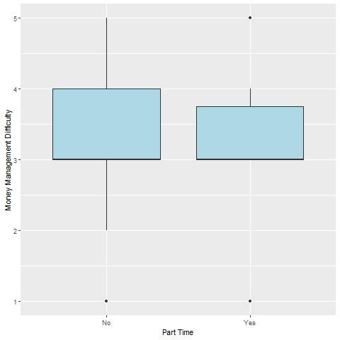
  - Parents' Influences
    ```
    jpeg("../images/Q5_Plot-PartTime_ParentsGoodExample.jpg")
      qplot(x = savingHabit$PartTime, y = savingHabit$ParentsGoodExample,
        geom = "boxplot", data = savingHabit,
        xlab = "Part Time", 
        ylab = "Parents Good Example",
        fill = I("lightblue"))
      dev.off()
    ```
    > Output:
    > 
  - Peer Influences
    ```
    jpeg("../images/Q5_Plot-PartTime_DiscussWithFriends.jpg")
      qplot(x = savingHabit$PartTime, y = savingHabit$DiscussWithFriends,
        geom = "boxplot", data = savingHabit,
        xlab = "Part Time", 
        ylab = "Discuss With Friends",
        fill = I("lightblue"))
      dev.off()
    ```
    > Output:
    > 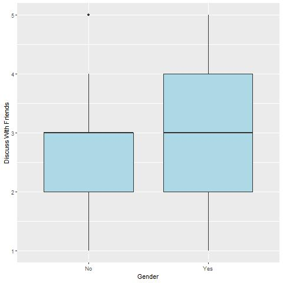
  - Self-Control Influences
    ```
    jpeg("../images/Q5_Plot-PartTime_BuyNowThinkLater.jpg")
      qplot(x = savingHabit$PartTime, y = savingHabit$BuyNowThinkLater,
        geom = "boxplot", data = savingHabit,
        xlab = "Part Time", 
        ylab = "Buy Now Think Later",
        fill = I("lightblue"))
      dev.off()
    ```
    > Output:
    > 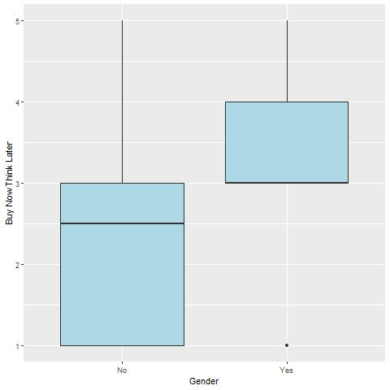
  - Saving Attitude
    ```
    jpeg("../images/Q5_Plot-PartTime_PutMoneyAside.jpg")
      qplot(x = savingHabit$PartTime, y = savingHabit$PutMoneyAside,
        geom = "boxplot", data = savingHabit,
        xlab = "Part Time", 
        ylab = "Put Money Aside",
        fill = I("lightblue"))
      dev.off()
    ```
    > Output:
    > 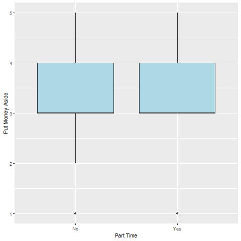

- Then, the t-test was done for all variables for `Part Time`:
  - Financial Influences
    ```
    PTFinancial <- t.test(financialInfluences ~ savingHabit$PartTime, data = savingHabit)
    print(PTFinancial)
    ```
    > Output:
    > ```
    > 	Welch Two Sample t-test
    > 
    > data:  financialInfluences by savingHabit$PartTime
    > t = 0.099318, df = 11.904, p-value =
    > 0.9225
    > alternative hypothesis: true difference in means is not equal to 0
    > 95 percent confidence interval:
    >  -0.6287234  0.6887234
    > sample estimates:
    >  mean in group No mean in group Yes 
    >              3.28              3.25 
    > ```
  - Parents' Influences
    ```
    PTParents <- t.test(parentsInfluences ~ savingHabit$PartTime, data = savingHabit)
    print(PTParents)
    ```
    > Output:
    > ```
    > 	Welch Two Sample t-test
    > 
    > data:  parentsInfluences by savingHabit$PartTime
    > t = 0.72931, df = 12.932, p-value =
    > 0.4788
    > alternative hypothesis: true difference in means is not equal to 0
    > 95 percent confidence interval:
    >  -0.3927603  0.7927603
    > sample estimates:
    >  mean in group No mean in group Yes 
    >              3.95              3.75 
    > ```
  - Peer Influences
    ```
    PTPeer <- t.test(peerInfluences ~ savingHabit$PartTime, data = savingHabit)
    print(PTPeer)
    ```
    > Output:
    > ```
    > 	Welch Two Sample t-test
    > 
    > data:  peerInfluences by savingHabit$PartTime
    > t = -0.87513, df = 11.072, p-value =
    > 0.4001
    > alternative hypothesis: true difference in means is not equal to 0
    > 95 percent confidence interval:
    >  -1.0539157  0.4539157
    > sample estimates:
    >  mean in group No mean in group Yes 
    >              2.85              3.15 
    > ```
  - Self-Control Influences
    ```
    PTSelfControl <- t.test(selfcontrolInfluences ~ savingHabit$PartTime, data = savingHabit)
    print(PTSelfControl)
    ```
    > Output:
    > ```
    > 	Welch Two Sample t-test
    > 
    > data:  selfcontrolInfluences by savingHabit$PartTime
    > t = -1.0431, df = 11.55, p-value = 0.3182
    > alternative hypothesis: true difference in means is not equal to 0
    > 95 percent confidence interval:
    >  -1.1771446  0.4171446
    > sample estimates:
    >  mean in group No mean in group Yes 
    >              2.77              3.15 
    > ```
  - Saving Attitude Influences
    ```
    PTSaving <- t.test(savingAttitude ~ savingHabit$PartTime, data = savingHabit)
    print(PTSaving)
    ```
    > Output:
    > ```
    > 	Welch Two Sample t-test
    > 
    > data:  savingAttitude by savingHabit$PartTime
    > t = -0.37818, df = 13.761, p-value =
    > 0.7111
    > alternative hypothesis: true difference in means is not equal to 0
    > 95 percent confidence interval:
    >  -0.6012535  0.4212535
    > sample estimates:
    >  mean in group No mean in group Yes 
    >              3.61              3.70 
    > ```

#### For Q5_2(c)
No code available.

#### For Q5_2(d)
- We generate the scatter plot for each variable:
  - Financial Awareness
    ```
    jpeg("../images/Q5_Scatter-PutMoneyAside_MoneyMgmtDifficulty.jpg")
    scatter.smooth(x=savingHabit$MoneyMgmtDifficulty, y = savingHabit$PutMoneyAside, xlab="Money Management", ylab="Saving Habits", main="Financial Awareness")
    dev.off() 
    ```
    > Output:
    > 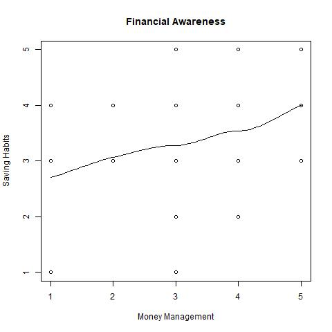
  - Parents Influence
    ```
    jpeg("../images/Q5_Scatter-PutMoneyAside_ParentsGoodExample.jpg")
    scatter.smooth(x=savingHabit$ParentsGoodExample, y = savingHabit$PutMoneyAside, xlab="Parents Good Example", ylab="Saving Habits", main="Parent's Influence")
    dev.off() 
    ```
    > Output:
    > 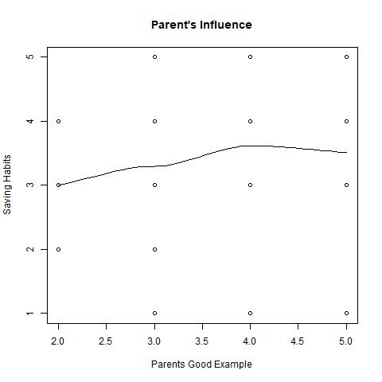
  - Peer Influence
    ```
    jpeg("../images/Q5_Scatter-PutMoneyAside_DiscussWithFriends.jpg")
    scatter.smooth(x=savingHabit$DiscussWithFriends, y = savingHabit$PutMoneyAside, xlab="Discuss With Friends", ylab="Saving Habits", main="Peer Influence Awareness")
    dev.off() 
    ```
    > Output:
    > 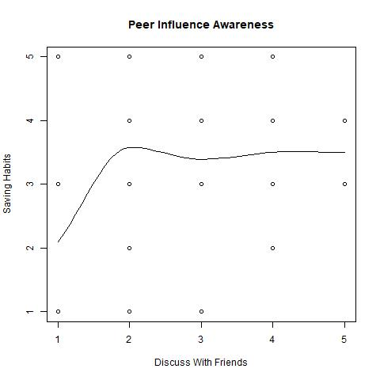
  - Self-Control
    ```
    jpeg("../images/Q5_Scatter-PutMoneyAside_BuyNowThinkLater.jpg")
    scatter.smooth(x=savingHabit$BuyNowThinkLater, y = savingHabit$PutMoneyAside, xlab="Buy Now Think Later", ylab="Saving Habits", main="Self-Control Awareness")
    dev.off()    
    ```
    > Output:
    > 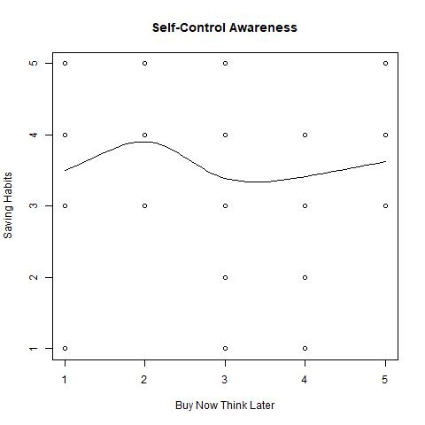

- The linear models for each variable is calculated:
  - Financial Awareness
    ```
    financialLinearModel <- lm(financialInfluences ~ savingAttitude, data = savingHabit)
    print(financialLinearModel)
    ```
    > Output:
    > ```
    > Call:
    > lm(formula = financialInfluences ~ savingAttitude, data = savingHabit)
    > 
    > Coefficients:
    >    (Intercept)  savingAttitude  
    >         2.0956          0.3253 
    > ```
  - Parents Influence
    ```
    parentsLinearModel <- lm(parentsInfluences ~ savingAttitude, data = savingHabit)
    print(parentsLinearModel)
    ```
    > Output:
    > ```
    > Call:
    > lm(formula = parentsInfluences ~ savingAttitude, data = savingHabit)
    > 
    > Coefficients:
    >    (Intercept)  savingAttitude  
    >         2.8313          0.2994
    > ```
  - Peer Influence
    ```
    peerLinearModel <- lm(peerInfluences ~ savingAttitude, data = savingHabit)
    print(peerLinearModel)
    ```
    > Output:
    > ```
    > Call:
    > lm(formula = peerInfluences ~ savingAttitude, data = savingHabit)
    > 
    > Coefficients:
    >    (Intercept)  savingAttitude  
    >         2.0028          0.2475 
    > ```
  - Self-Control
    ```
    selfcontrolLinearModel <- lm(selfcontrolInfluences ~ savingAttitude, data = savingHabit)
    print(selfcontrolLinearModel)
    ```
    > Output:
    > ```
    > Call:
    > lm(formula = selfcontrolInfluences ~ savingAttitude, data = savingHabit)
    > 
    > Coefficients:
    >    (Intercept)  savingAttitude  
    >        2.51497         0.08782 
    > ```

- Then, we find the errors in the data:
  ```
  sigmaFinancial <- sigma(financialLinearModel)*100/mean(savingAttitude)
  sigmaParents <- sigma(parentsLinearModel)*100/mean(savingAttitude)
  sigmaPeer <- sigma(peerLinearModel)*100/mean(savingAttitude)
  sigmaSelfControl <- sigma(selfcontrolLinearModel)*100/mean(savingAttitude)
  
  cat(" Percentage error of Financial: ", sigmaFinancial, "\n Percentage error of Parents: ", sigmaParents, "\n Percentage error of Peer: ", sigmaPeer, "\n Percentage error of Self-Control: ", sigmaSelfControl)
  ```
  > Output:
  > ```
  > Percentage error of Financial:  20.93333 
  > Percentage error of Parents:  21.20684 
  > Percentage error of Peer:  22.02786 
  > Percentage error of Self-Control:  25.63666
  > ```

- From that, we can conclude the variable that is affected the most:
  ```
  cat("\n The variable affected the most on saving attitude the variable with a percentage error of", max(sigmaFinancial, sigmaParents, sigmaPeer, sigmaSelfControl), ", in this case is Financial.")
  ```
  > Output:
  > ```
  > The variable affected the most on saving attitude the variable with a percentage error of 25.63666 , in this case is Financial.
  > ```

#### For Q5_2(e)
- We find the linear correlation coefficient using the following code, then print it out:
  ```
  coeFinancial <- cor(financialInfluences, savingAttitude)
  coeParents <- cor(parentsInfluences, savingAttitude)
  coePeer <- cor(peerInfluences, savingAttitude)
  coeSelfControl <- cor(selfcontrolInfluences, savingAttitude)
  cat(" The correlation coefficient of financial is: ", coeFinancial, "\n", "The correlation coefficient of Parents is: ", coeParents, " \n The correlation coefficient of Peer is: ", coePeer, "\n The correlation coefficient of Self-Control is: ", coeSelfControl)
  ```
  > Output:
  > ```
  > The correlation coefficient of financial is:  0.3004705 
  > The correlation coefficient of Parents is:  0.2751205  
  > The correlation coefficient of Peer is:  0.2220588 
  > The correlation coefficient of Self-Control is:  0.06927013
  > ```

#### For Q5_2(f)
- We first import the required libraries:
  ```
  library(BBmisc)
  ```

- The correlation matrix is calculated and placed into a data frame.
  ```
  factors = c(rep("financialInfluences", 60), rep("parentInfluences", 60), rep("peerInfluences", 60), rep("selfcontrolInfluences", 60), rep("Age", 60), rep("Faculty", 60), rep("Financial", 60), rep("Allowance", 60))
  savingHabit$Allowance = normalize(savingHabit$Allowance, method = "standardize", range = c(0, 5), margin = 1L, on.constant = "quiet")
  savingHabit$Age = normalize(savingHabit$Age, method = "standardize", range = c(0, 5), margin = 1L, on.constant = "quiet")
  combinedData = c(financialInfluences, parentsInfluences,peerInfluences,selfcontrolInfluences, savingHabit$Age, savingHabit$Faculty, savingHabit$FinancialMethods, savingHabit$Allowance)
  df <- data.frame(factors,combinedData)
  ```

- We calculate the combined data plot
  ```
  jpeg("../images/Q5_CombinedDataPlot.jpg")
  plot(combinedData ~ factors, data=df)
  dev.off()
  ```
  > Output:
  > 

- We then make the ANOVA summary.
  ```
  print(aov(combinedData ~ factors, data =df))
  summary(aov)
  ```
  > Output:
  > ```
  > Call:
  >    aov(formula = combinedData ~ factors, data = df)
  > 
  > Terms:
  >                   factors Residuals
  > Sum of Squares  1235.2370  521.9458
  > Deg. of Freedom         7       472
  > 
  > Residual standard error: 1.051579
  > Estimated effects may be unbalanced
  > ```
