# Q5_2(a) Demographic Profile
- Gender  
  | Category | Frequency | Relative Frequency | Percentage Distribution |  
  | --- | --- | --- | --- |  
  | Female | 28 | 0.4666667 | 46.66667 |  
  | Male | 32 | 0.5333333 | 53.33333 |  
  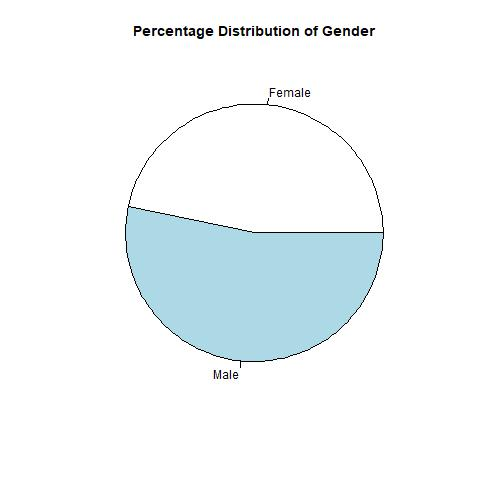
- Age
  | Category | Frequency | Relative Frequency | Percentage Distribution |
  | --- | --- | --- | --- |
  | 19.5 | 24 | 0.40000000 | 40.000000 |
  | 21.5 | 32 | 0.53333333 | 53.333333 |
  | 24.0 | 4 | 0.06666667 | 6.666667 |
  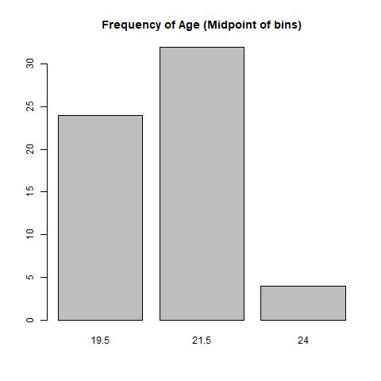
- Saving Habit
  | Category | Frequency | Relative Frequency | Percentage Distribution |
  | --- | --- | --- | --- |
  | FKE | 8 | 0.13333333 | 13.333333 |
  | FKM | 4 | 0.06666667 | 6.666667 |
  | FKP | 3 | 0.05000000 | 5.000000 |
  | FPTT | 3 | 0.05000000 | 5.000000 |
  | FTKEE | 2 | 0.03333333 | 3.333333 |
  | FTMK | 40 | 0.66666667 | 66.666667 |
  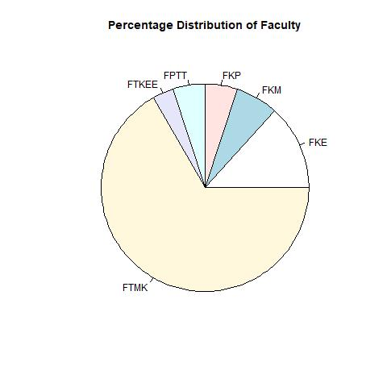
- Allowance
  | Category | Frequency | Relative Frequency | Percentage Distribution |
  | --- | --- | --- | --- |
  | 100 | 31 | 0.5166667 | 51.66667 |
  | 350.5 | 22 | 0.3666667 | 36.66667 |
  | 650.5 | 7 | 0.1166667 | 11.66667 |
  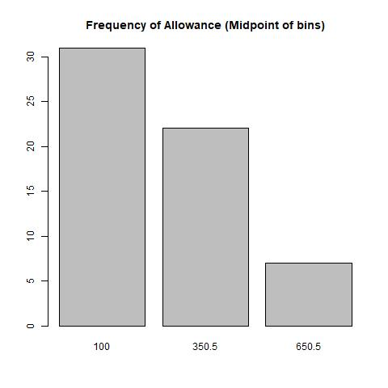
- If student is taking a part time job:
  | Category | Frequency | Relative Frequency | Percentage Distribution |
  | --- | --- | --- | --- |
  | No | 50 | 0.8333333 | 83.33333 |
  | Yes | 10 | 0.1666667 | 16.66667 |
  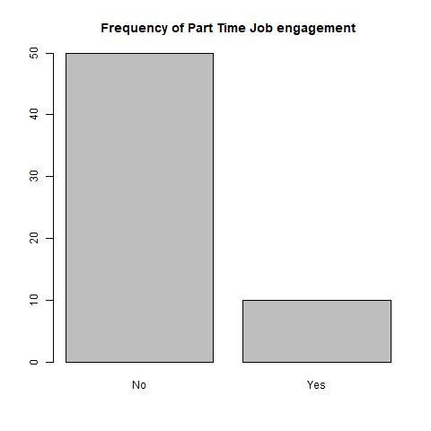
- If a student has difficulty in managing money:
  | Category | Frequency | Relative Frequency | Percentage Distribution |
  | --- | --- | --- | --- |
  | 1 | 4 | 0.06666667 | 6.666667 |
  | 2 | 7 | 0.11666667 | 11.666667 |
  | 3 | 25 | 0.41666667 | 41.666667 |
  | 4 | 16 | 0.26666667 | 26.666667 |
  | 5 | 8 | 0.13333333 | 13.333333 |
  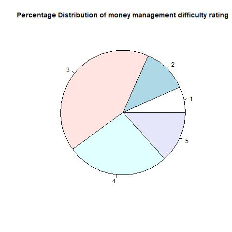
- If the student has ability to prepare his/her own weekly/monthly budget:
  | Category | Frequency | Relative Frequency | Percentage Distribution |
  | --- | --- | --- | --- |
  | 2 | 13 | 0.2166667 | 21.66667 |
  | 3 | 27 | 0.4500000 | 45.00000 |
  | 4 | 11 | 0.1833333 | 18.33333 |
  | 5 | 9 | 0.1500000 | 15.00000 |
  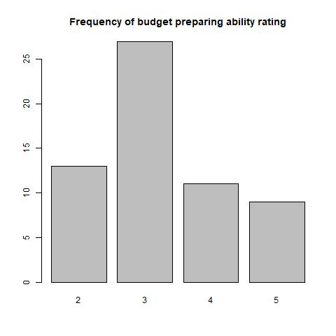
- If the student's parents' are good examples when it comes to money management:
  | Category | Frequency | Relative Frequency | Percentage Distribution |
  | --- | --- | --- | --- |
  | 2 | 3 | 0.05 | 5.00 |
  | 3 | 21 | 0.35 | 35.00 |
  | 4 | 21 | 0.35 | 35.00 |
  | 5 | 15 | 0.25 | 25.00 |
  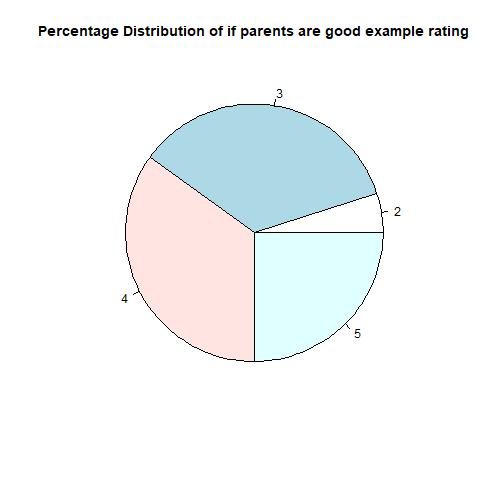
- If the student appreciate it when parents give advice about what to do with money:
  | Category | Frequency | Relative Frequency | Percentage Distribution |
  | --- | --- | --- | --- |
  | 2 | 1 | 0.01666667 | 1.666667 |
  | 3 | 16 | 0.26666667 | 26.666667 |
  | 4 | 23 | 0.38333333 | 38.333333 |
  | 5 | 20 | 0.33333333 | 33.333333 |
  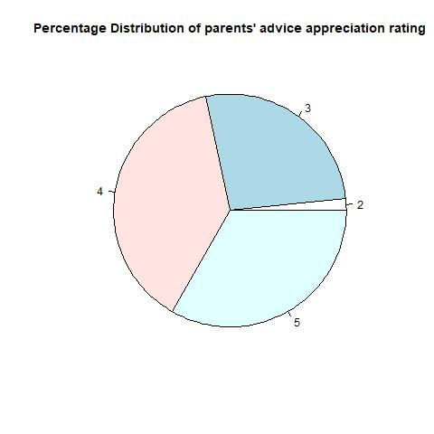
- If friends do regularly save with savings account:
  | Category | Frequency | Relative Frequency | Percentage Distribution |
  | --- | --- | --- | --- |
  | 1 | 4 | 0.06666667 | 6.666667 |
  | 2 | 15 | 0.25000000 | 25.000000 |
  | 3 | 18 | 0.30000000 | 30.000000 |
  | 4 | 16 | 0.26666667 | 26.666667 |
  | 5 | 7 | 0.11666667 | 11.666667 |
  
- If the student regularly discusses about money management issue (saving) with friends:
  | Category | Frequency | Relative Frequency | Percentage Distribution |
  | --- | --- | --- | --- |
  | 1 | 7 | 0.1166667 | 11.66667 |
  | 2 | 19 | 0.3166667 | 31.66667 |
  | 3 | 23 | 0.3833333 | 38.33333 |
  | 4 | 8 | 0.1333333 | 13.33333 |
  | 5 | 3 | 0.0500000 | 5.00000 |
  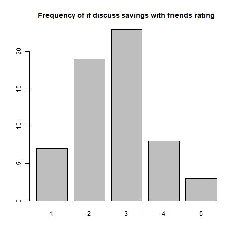
- If "buy now, think later" describes them:
  | Category | Frequency | Relative Frequency | Percentage Distribution |
  | --- | --- | --- | --- |
  | 1 | 17 | 0.28333333 | 28.333333 |
  | 2 | 10 | 0.16666667 | 16.666667 |
  | 3 | 20 | 0.33333333 | 33.333333 |
  | 4 | 9 | 0.15000000 | 15.000000 |
  | 5 | 4 | 0.06666667 | 6.666667 |
  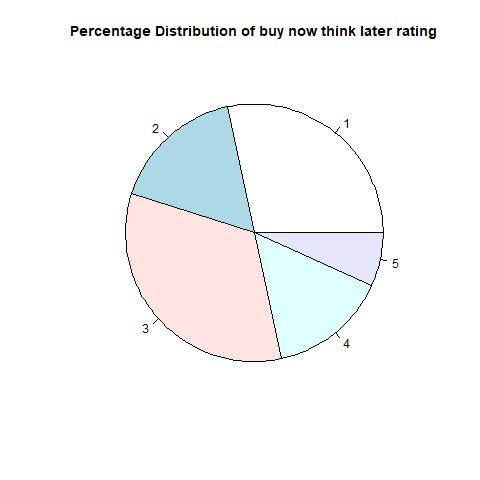
- If rarely achieve saving goals:
  | Category | Frequency | Relative Frequency | Percentage Distribution |
  | --- | --- | --- | --- |
  | 1 | 3 | 0.05000000 | 5.000000 |
  | 2 | 12 | 0.20000000 | 20.000000 |
  | 3 | 25 | 0.41666667 | 41.666667 |
  | 4 | 15 | 0.25000000 | 25.000000 |
  | 5 | 5 | 0.08333333 | 8.333333 |
  
- If put money aside on a regular basis for the future:
  | Category | Frequency | Relative Frequency | Percentage Distribution |
  | --- | --- | --- | --- |
  | 1 | 5 | 0.08333333 | 8.333333 |
  | 2 | 2 | 0.03333333 | 3.333333 |
  | 3 | 27 | 0.45000000 | 45.000000 |
  | 4 | 21 | 0.35000000 | 35.000000 |
  | 5 | 5 | 0.08333333 | 8.333333 |
  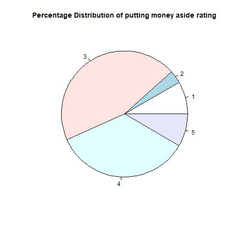
- If often compare prices before making a purchase:
  | Category | Frequency | Relative Frequency | Percentage Distribution |
  | --- | --- | --- | --- |
  | 2 | 5 | 0.08333333 | 8.333333 |
  | 3 | 14 | 0.23333333 | 23.333333 |
  | 4 | 21 | 0.35000000 | 35.000000 |
  | 5 | 20 | 0.33333333 | 33.333333 |
  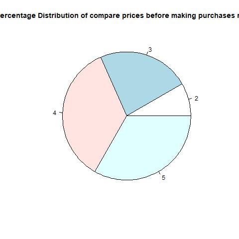

# Q5_2(b) Means comparison

