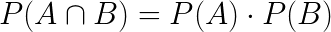
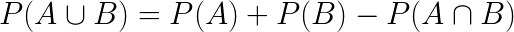
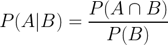
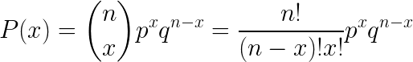

# Report

## Question 1

---
## Question 2
This question presents a problem to calculate the probability of getting a specific branded phone with a specific condition. (E.g. The probability of getting an `Apple` branded phone with `good` condition)

[This data](./src/data/Q2_data.txt) was collected randomly from people around, where those people having only phones with brands `Apple`, `Samsung` and `Xiaomi` were required to rate their current phone situation from the metrics `Excellent`, `Good` and `Bad`.

As we are only evaluating probabilities of a given scenario, we therefore will be using the following formulae:

- Probability of A and B (Intercept)  


- Probability of A or B (Union)  


- Conditional Probability  


Where each `A` and `B` refer to their own criteria.

### The following codes were used (output line breaks are omitted):

- We first import the data after collecting them:
  ```
  Q2_data <- read.delim("~/GIT-Code/UTeM-R.Programming_Stat.Project/src/data/Q2_data.txt")
  View(Q2_data)
  rows = nrow(Q2_data)
  print(cat(rows, "rows of data imported."))
  ```
  > Output:
  > ```
  > 60 rows of data imported.NULL
  > ```

- We then calculate the frequencies (E.g. How many times a brand or a condition happened) and the proportion of each data (E.g. What is a good phone's appearance proportion)
  ```
  # Assigns brand and condition variables
  brand = Q2_data$phone_brand
  condition = Q2_data$condition
  
  # Calculating the occurence of each attribute
  brand.freq = table(brand)
  condition.freq = table(condition)
  
  # Calculating the probablities of the occurences
  brand.prob = brand.freq / rows
  condition.prob = condition.freq / rows
  ```

- We then define functions for `and`, `or` and `givenThat`(conditional probability).
  - And
    ```
    and <- function(brandName, conditionStatus){
    return(brand.prob[[brandName]] * condition.prob[[conditionStatus]])
    }
    ```
  - Or
    ```
    or <- function(brandName, conditionStatus){
    return(brand.prob[[brandName]] + condition.prob[[conditionStatus]]-and(brandName, conditionStatus))
    }
    ```
  - Given that (Conditional probability)
    ```
    given <- function(brandName, conditionStatus, givenThat){
    return( and(brandName, conditionStatus) / givenThat)
    }
    ```
  Where:
    - [string] `brandname` is the brand name to be selected from the table
    - [string] `conditionStatus` is the phone's condition to be selected from the table
    - [long] `givenThat` is the probability of the source condition. (E.g. if wanting to evaluate P(A|B), then the value of P(B) should be passed.)

- We then input the variables based on the problem requirements:
  - The probability that a phone is branded `'Samsung'` and has `good` condition
    ```
    print("a) The probability that a phone is branded 'Samsung' and has good condition is :")
    print(and("Samsung", "Good"))
    ```
    > Output:
    > ```
    > [1] 0.1055556
    > ```

  - The probability that a phone is branded `'Apple'` and has `bad` condition
    ```
    print(and(brandName = "Apple", conditionStatus = "Bad"))
    ```
    > Output:
    > ```
    > [1] 0.1866667
    > ```
  
  - The probability that the phone is branded `'Samsung'` and `'Apple'`
    ` Probably is an error in question `

  - The probability that a phone is branded `'Xiaomi'` or have `good` condition
    ```
    print(or("Xiaomi", "Good"))
    ```
    > Output:
    > ```
    > [1] 0.4988889
    > ```

  - The probability that a phone is branded `'Xiaomi'` or have `excellent` condition
    ```
    print(or(conditionStatus = "Excellent", brandName = "Xiaomi"))
    ```
    > Output:
    > ```
    > [1] 0.4255556
    > ```

  - The probability that a phone is branded `'Xiaomi'` or `'Apple'`
    ```
    print(brand.prob[["Xiaomi"]] + brand.prob[["Apple"]])
    ```
    > Output:
    > ```
    > [1] 0.6666667
    > ```

  - The probability that a phone is having a good condition given a brand.
    - The probability that a phone is having a `good` condition given that it is branded `'Apple'`
    ```
    print(given("Apple", "Good", brand.prob[["Apple"]]))
    ```
    > Output:
    > ```
    > [1] 0.3166667
    > ```

    - The probability that a phone is having a `good` condition given that it is branded `'Xiaomi'`
    ```
    print(given("Xiaomi", "Good", brand.prob[["Xiaomi"]]))
    ```
    > Output:
    > ```
    > [1] 0.3166667
    > ```

    - The probability that a phone is having a `good` condition given that it is branded `'Samsung'`
    ```
    print(given("Samsung", "Good", brand.prob[["Samsung"]]))
    ```
    > Output:
    > ```
    > [1] 0.3166667
    > ```

  ### Conclusion
  Therefore from the data:
  - The probability that a phone is branded `'Samsung'` and has `good` condition is `0.1055556`
  - The probability that a phone is branded `'Apple'` and has `bad` condition is `0.1866667`
  - The probability that the phone is branded `'Samsung'` and `'Apple'` is `0`
  - The probability that a phone is branded `'Xiaomi'` or have `good` condition is `0.4988889`
  - The probability that a phone is branded `'Xiaomi'` or have `excellent` condition is `0.4255556`
  - The probability that a phone is branded `'Xiaomi'` or `'Apple'` is `0.6666667`
  - The probability that a phone is having a `good` condition given that it is branded `'Apple'` is `0.3166667`
  - The probability that a phone is having a `good` condition given that it is branded `'Xiaomi'` is `0.3166667`
  - The probability that a phone is having a `good` condition given that it is branded `'Samsung'` is `0.3166667`
  - From the 3 previous results, we can also conclude that no phone brand is better as they are `equal` in producing `good` phones.

---
## Question 3
This question presents a problem to calculate the probability of a student getting a number of specified grades given a sample. (E.g. The probability of the student getting 5 As out of 9 subjects.)

[This data](./src/data/Q3_data.txt) was collected from an anonymous volunteer, where he/she shared his/her 100 previous grades.

> The problem gives us a property of it being:
> - It has a fixed number of trials (9)
> - There are only 2 outcomes for each trial ('A' or 'not A')
> - The trials are independant (any subject getting an 'A' does not have influence over whether the next subject will get an 'A')
> - The probabilities are constant for each trial (it is calculated from historic data and no data will be added throughout the calculations)

As such, we use the binomial distribution fomula as shown below:


Where :
- `n = number of subjects` , 
- `x = the number of specified grades` , 
- `p = the probability of getting a grade`

### The following codes were used (output line breaks are omitted):

- We first import the data after collecting them:
  ```
  Q3_data <- read.csv("~/GIT-Code/UTeM-R.Programming_Stat.Project/src/data/Q3_data.txt", sep="")
  View(Q3_data)
  rows = nrow(Q3_data)
  print(cat(rows, "rows of data imported."))
  ```
  > Output:
  > ```
  > 100 rows of data imported.NULL
  > ```

- We then get the frequencies (e.g. How many times does 'A' appear etc.) and the proportion of each data (e.g. What is 'A's appearance proportion)
  ```
  grades = Q3_data
  grades.freq = table(grades)
  grades.prob = grades.freq / rows
  ```

- We define a universal function that takes 3 arguments to output the happenings' probability based on the binomial model.
  ```
  probs <- function(fromThis, chooseThis, thisSign){
    return(dbinom(chooseThis, size=fromThis, grades.prob[[thisSign]]))
  }
  ```
  Where:
  - [integer] `fromThis` is the number of trials being done.
  - [integer] `chooseThis` is the number of occurence of a particular grade.
  - [string] `thisSign` the grade to be tested.

- We then input the variables based on the problem requirements:
  - 4 of 9 subjects get `A`
    ```
    print(probs(9, 4, "A"))
    ```
    > Output:
    > ```
    > [1] 0.06606029
    > ```

  - 5 of 9 subjects get `B`
    ```
    print(probs(9, 5, "B"))
    ```
    > Output:
    > ```
    > [1] 0.003706846
    > ```

  - 3 of 9 subjects get `C`
    ```
    print(probs(9, 3, "C"))
    ```
    > Output:
    > ```
    > [1] 0.1489292
    > ```

  - 1 or 9 subjects get `D`
    ```
    print(probs(9, 1, "D"))
    ```
    > Output:
    > ```
    > [1] 0.3311508
    > ```

  ### Conclusion
  Therefore for this student:
  - The probability for `4 of 9` subjects getting `A` is `0.06606029`
  - The probability for `5 of 9` subjects getting `B` is `0.003706846`
  - The probability for `3 of 9` subjects getting `C` is `0.1489292`
  - The probability for `1 of 9` subjects getting `D` is `0.3311508`

---
## Question 4

