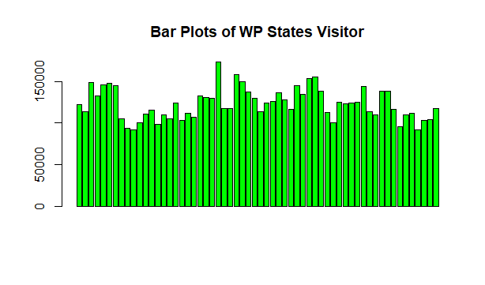
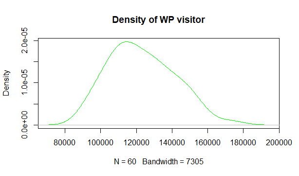

# Report

## Question 1
This question requires us to calculate the sample means, medians, modes, variances and standard deviations from the `UTC visitor's statistic year 2013-17` dataset. 
It also requests us to draw a graph to summarize features that draw a distinction between the visitor satistics to conclude and inference on the reasons of the data occurences.
`We are only required to do the above for areas "Perak", "Melaka" and "Wilayah Persekutuan Kuala Lumpur"`

The [UTC visitor’s statistic year 2013-2017](http://www.data.gov.my/data/dataset/028b136e-fcbf-426f-9a52-2de2a21cfbef/resource/ce75b7bf-9740-45d1-b703-3372e7001cab/download/statistik-utc-negeri-mengikut-bulan-2013-2017.xlsx) dataset was downloaded from the govenment's open data webpage. It describes the number of visitors visiting the Urban Transformation Center in each state every month.

As we are calculating the mean, median, variance and standard deviation of the data, we will using the following formulae:

- Mean of a sample


- Median of a sample


- Variance of a sample


- Standard deviation of a sample


### The following codes were used (output line breaks are omitted):
- We first import the data requried:
```
library(readxl)

# Import the dataset
data <- read_xlsx("./data/utc_stat.xlsx", 1)

# Select only Melaka, WP KL, and Perak States data
year_char <- data[-1,2]
melaka_visitor <- data[-1,3]
wp_visitor <- data[-1,4]
perak_visitor <- data[-1,5]
```

- We then preprocess the data:
```
# Convert dataframe to numerical variables
melaka_visitor = as.numeric(unlist(melaka_visitor))
wp_visitor = as.numeric(unlist(wp_visitor))
perak_visitor = as.numeric(unlist(perak_visitor))

# Create a new dataframe of only this 3 states data
States_df <- data.frame(year_char,melaka_visitor, wp_visitor, perak_visitor)
```

- We then calculate the values based on the problem requirements:
  - Mean
    ```
    mean_melaka = mean(melaka_visitor)
    mean_wp = mean(wp_visitor)
    mean_perak = mean(perak_visitor)
    ```
  - Median
    ```
    median_melaka = median(melaka_visitor)
    median_wp = median(wp_visitor)
    median_perak = median(perak_visitor)
    ```
  - Mode
    ```
    mode_melaka = max(melaka_visitor)
    mode_wp = max(wp_visitor)
    mode_perak = max(perak_visitor)
    ```
  - Variance
    ```
    var_melaka = var(melaka_visitor)
    var_wp = var(wp_visitor)
    var_perak = var(perak_visitor)
    ```
  - Standard Deviation
    ```
    sd_melaka = sd(melaka_visitor)
    sd_wp = sd(wp_visitor)
    sd_perak = sd(perak_visitor)
    ```

- The results were outputted:
  ```
  cat("Result:\n\n Mean Melaka:",mean_melaka,"\n Mean WP:",mean_wp,"\n Mean Perak:",mean_perak,"\n \n Median Melaka:",median_melaka,"\n Median WP:",median_wp,"\n Median Perak:",median_perak,"\n \n Mode Melaka:", mode_melaka,"\n Mode WP:", mode_wp,"\n Mode Perak:", mode_perak,"\n\n Variance Melaka:", var_melaka, "\n Variance WP:", var_wp, "\n Variance Perak:",var_perak,"\n\n SD Melaka:",sd_melaka,"\n SD WP:",sd_wp,"\n SD Perak:",sd_perak)
  ```
  Output:
  >

- The barplots are then drawn:
  - Barplots of Melaka States Visitor
    ```
    barplot(States_df$melaka_visitor, main = "Bar Plots of Melaka States Visitor", col="skyblue")
    ```
    Output:
    > 
  - Barplots of WP States Visitor
    ```
    barplot(States_df$wp_visitor, main = "Bar Plots of WP States Visitor", col="green")
    ```
    Output:
    > 
  - Barplots of Perak States Visitor
    ```  
    barplot(States_df$perak_visitor, main = "Bar Plots of Perak States Visitor", col="red")
    ```
    Output:
    > 

- The density plots are then drawn:
  - Density plot of Melaka States Visitor
    ```
    plot(density(States_df$melaka_visitor), main = "Density of melaka visitor", col="skyblue" )
    ```
    Output:
    > 
  - Density plot of WP States Visitor
    ```
    plot(density(States_df$wp_visitor), main = "Density of WP visitor", col="green" )
    ```
    Output:
    > 
  - Density plot of Perak States Visitor
    ```
    plot(density(States_df$perak_visitor), main = "Density of Perak visitor", col="red" )
    ```
    Output:
    > 
    
- The combined chart for visitors of each state with respect of month was then plotted:
  ```
  plot(States_df$perak_visitor,type = "o",col = "red", xlab = "Month", ylab = "Number of visitor", 
       main = "Melaka, WP and Perak Visitor Chart")
  lines(States_df$wp_visitor, type = "o", col = "green")
  lines(States_df$melaka_visitor, type = "o", col = "skyblue")
  legend("topright", legend=c("Perak", "WP", "Melaka"),col=c("red", "green","skyblue"), lty=1, cex=0.8)
  ```
  Output:
  > 

  ### Conclusion
  

---
## Question 2
This question presents a problem to calculate the probability of getting a specific branded phone with a specific condition. (E.g. The probability of getting an `Apple` branded phone with `good` condition)

[This data](./src/data/Q2_data.txt) was collected randomly from people around, where those people having only phones with brands `Apple`, `Samsung` and `Xiaomi` were required to rate their current phone situation from the metrics `Excellent`, `Good` and `Bad`.

As we are only evaluating probabilities of a given scenario, we therefore will be using the following formulae:

- Probability of A and B (Intercept)  


- Probability of A or B (Union)  


- Conditional Probability  


Where each `A` and `B` refer to their own criteria.

### The following codes were used (output line breaks are omitted):

- We first import the data after collecting them:
  ```
  Q2_data <- read.delim("~/GIT-Code/UTeM-R.Programming_Stat.Project/src/data/Q2_data.txt")
  View(Q2_data)
  rows = nrow(Q2_data)
  print(cat(rows, "rows of data imported."))
  ```
  > Output:
  > ```
  > 60 rows of data imported.NULL
  > ```

- We then calculate the frequencies (E.g. How many times a brand or a condition happened) and the proportion of each data (E.g. What is a good phone's appearance proportion). The frequency table is then displayed.
  ```
  # Assigns brand and condition variables
  brand = Q2_data$phone_brand
  condition = Q2_data$condition
  
  # Calculating the occurence of each attribute
  brand.freq = table(brand)
  condition.freq = table(condition)

  # Calculating the occurence of each state
  dataOccurence = paste(Q2_data$phone_brand, Q2_data$condition)
  dataOccurence.freq = table(dataOccurence)
  
  # Calculating the probablities of the occurences
  brand.prob = brand.freq / rows
  condition.prob = condition.freq / rows
  dataOccurence.prob = dataOccurence.freq / rows
  
  # Showing the results in a table
  cbind(brand.freq)
  cbind(condition.freq)
  ```
    > Output:
    > ```
    >           brand.freq
    > Apple           24
    > Samsung         20
    > Xiaomi          16
    > 
    >           condition.freq
    > Bad                   28
    > Excellent             13
    > Good                  19
    > ```


- We then define functions for `and`, `or` and `givenThat`(conditional probability).
  - And
    ```
    and <- function(brandName, conditionStatus){
    return(brand.prob[[brandName]] * condition.prob[[conditionStatus]])
    }
    ```
  - Or
    ```
    or <- function(brandName, conditionStatus){
    return(brand.prob[[brandName]] + condition.prob[[conditionStatus]]-and(brandName, conditionStatus))
    }
    ```
  - Given that (Conditional probability)
    ```
    given <- function(condition, givenThat){
    return(dataOccurence.freq[[condition]] / givenThat)
    }
    ```
  Where:
    - [string] `condition` is the brand name and condition to be selected from the table.
    - [long] `givenThat` is the frequency of the source condition. (E.g. if wanting to evaluate P(A|B), then the value of n(B) should be passed.)

- We then input the variables based on the problem requirements:
  - The probability that a phone is branded `'Samsung'` and has `good` condition
    ```
    print("a) The probability that a phone is branded 'Samsung' and has good condition is :")
    print(and("Samsung", "Good"))
    ```
    > Output:
    > ```
    > [1] 0.1055556
    > ```

  - The probability that a phone is branded `'Apple'` and has `bad` condition
    ```
    print(and(brandName = "Apple", conditionStatus = "Bad"))
    ```
    > Output:
    > ```
    > [1] 0.1866667
    > ```
  
  - The probability that the phone is branded `'Samsung'` and `'Apple'`
    ` Probably is an error in question `

  - The probability that a phone is branded `'Xiaomi'` or have `good` condition
    ```
    print(or("Xiaomi", "Good"))
    ```
    > Output:
    > ```
    > [1] 0.4988889
    > ```

  - The probability that a phone is branded `'Xiaomi'` or have `excellent` condition
    ```
    print(or(conditionStatus = "Excellent", brandName = "Xiaomi"))
    ```
    > Output:
    > ```
    > [1] 0.4255556
    > ```

  - The probability that a phone is branded `'Xiaomi'` or `'Apple'`
    ```
    print(brand.prob[["Xiaomi"]] + brand.prob[["Apple"]])
    ```
    > Output:
    > ```
    > [1] 0.6666667
    > ```

  - The probability that a phone is having a good condition given a brand.
    - The probability that a phone is having a `good` condition given that it is branded `'Apple'`
    ```
    print(given("Apple Good", brand.freq[["Apple"]]))
    ```
    > Output:
    > ```
    > [1] 0.3333333
    > ```

    - The probability that a phone is having a `good` condition given that it is branded `'Xiaomi'`
    ```
    print(given("Xiaomi Good", brand.freq[["Xiaomi"]]))
    ```
    > Output:
    > ```
    > [1] 0.375
    > ```

    - The probability that a phone is having a `good` condition given that it is branded `'Samsung'`
    ```
    print(given("Samsung Good", brand.freq[["Samsung"]]))
    ```
    > Output:
    > ```
    > [1] 0.25
    > ```

  ### Conclusion
  Therefore from the data:
  - The probability that a phone is branded `'Samsung'` and has `good` condition is `0.1055556`
  - The probability that a phone is branded `'Apple'` and has `bad` condition is `0.1866667`
  - The probability that the phone is branded `'Samsung'` and `'Apple'` is `0`
  - The probability that a phone is branded `'Xiaomi'` or have `good` condition is `0.4988889`
  - The probability that a phone is branded `'Xiaomi'` or have `excellent` condition is `0.4255556`
  - The probability that a phone is branded `'Xiaomi'` or `'Apple'` is `0.6666667`
  - The probability that a phone is having a `good` condition given that it is branded `'Apple'` is `0.3333333`
  - The probability that a phone is having a `good` condition given that it is branded `'Xiaomi'` is `0.375`
  - The probability that a phone is having a `good` condition given that it is branded `'Samsung'` is `0.25`
  - From the 3 previous results, we can also conclude that `Xiaomi` is the best at creating `good` phones.

---
## Question 3
This question presents a problem to calculate the probability of a student getting a number of specified grades given a sample. (E.g. The probability of the student getting 5 As out of 9 subjects.)

[This data](./src/data/Q3_data.txt) was collected from an anonymous volunteer, where he/she shared his/her 100 previous grades.

> The problem gives us a property of it being:
> - It has a fixed number of trials (9)
> - There are only 2 outcomes for each trial ('A' or 'not A')
> - The trials are independant (any subject getting an 'A' does not have influence over whether the next subject will get an 'A')
> - The probabilities are constant for each trial (it is calculated from historic data and no data will be added throughout the calculations)

As such, we use the binomial distribution fomula as shown below:


Where :
- `n = number of subjects` , 
- `x = the number of specified grades` , 
- `p = the probability of getting a grade`

### The following codes were used (output line breaks are omitted):

- We first import the data after collecting them:
  ```
  Q3_data <- read.csv("~/GIT-Code/UTeM-R.Programming_Stat.Project/src/data/Q3_data.txt", sep="")
  View(Q3_data)
  rows = nrow(Q3_data)
  print(cat(rows, "rows of data imported."))
  ```
  > Output:
  > ```
  > 100 rows of data imported.NULL
  > ```

- We then get the frequencies (e.g. How many times does 'A' appear etc.) and the proportion of each data (e.g. What is 'A's appearance proportion)
  ```
  grades = Q3_data
  grades.freq = table(grades)
  grades.prob = grades.freq / rows
  ```

- We then output the frequency table of each grade occurence:
  ```
  cbind(grades.freq)
  ```
  > Output:
  > ```
  > [1] " "
  >   grades.freq
  > A          20
  > B          14
  > C          18
  > D          18
  > E          10
  > F          20
  > ```

- We define a universal function that takes 3 arguments to output the happenings' probability based on the binomial model.
  ```
  probs <- function(fromThis, chooseThis, thisSign){
    return(dbinom(chooseThis, size=fromThis, grades.prob[[thisSign]]))
  }
  ```
  Where:
  - [integer] `fromThis` is the number of trials being done.
  - [integer] `chooseThis` is the number of occurence of a particular grade.
  - [string] `thisSign` the grade to be tested.

- We then input the variables based on the problem requirements:
  - 4 of 9 subjects get `A`
    ```
    print(probs(9, 4, "A"))
    ```
    > Output:
    > ```
    > [1] 0.06606029
    > ```

  - 5 of 9 subjects get `B`
    ```
    print(probs(9, 5, "B"))
    ```
    > Output:
    > ```
    > [1] 0.003706846
    > ```

  - 3 of 9 subjects get `C`
    ```
    print(probs(9, 3, "C"))
    ```
    > Output:
    > ```
    > [1] 0.1489292
    > ```

  - 1 or 9 subjects get `D`
    ```
    print(probs(9, 1, "D"))
    ```
    > Output:
    > ```
    > [1] 0.3311508
    > ```

  ### Conclusion
  Therefore for this student:
  - The probability for `4 of 9` subjects getting `A` is `0.06606029`
  - The probability for `5 of 9` subjects getting `B` is `0.003706846`
  - The probability for `3 of 9` subjects getting `C` is `0.1489292`
  - The probability for `1 of 9` subjects getting `D` is `0.3311508`

---
## Question 4

