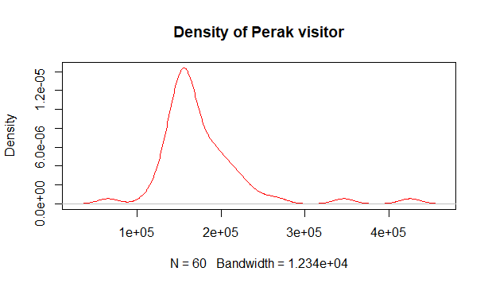

# Question 1
## Calculations (Mean, Media, Mode, Variance and Standard Deviation)

| State | Mean | Median | Mode | Variance | Standard Deviation |
| --- | --- | --- | --- | --- | --- | 
| Melaka | 93,756.12 | 96,719 | 163,386 | 875,363,366 | 29,586.54 |
| WP | 123,094.8 | 122,446.5 | 173,210 | 338,842,768 | 18,407.68 |
| Perak | 176,081.4 | 161,672.5 | 425,000 | 2,710,490,245 | 52,062.37 |

## Graphing
### Bar Plots of each area

### Density Plots of each area

### Combined graph

# Question 2
## Data Summary
- Brand Summary

  | Brand | Frequency |
  | --- | --- |
  | Apple | 24 |
  | Samsung | 20 |
  | Xiaomi | 16 |

- Condition Summary
  
  | Condition | Frequency |
  | --- | --- |
  | Bad | 28 |
  | Excellent | 13 |
  | Good | 19 |

## Results
From the data, we can conclude that:
- The probability that a phone is branded `'Samsung'` and has `good` condition is `0.1055556` .
- The probability that a phone is branded `'Apple'` and has `bad` condition is `0.1866667` .
- The probability that the phone is branded `'Samsung'` and `'Apple'` is `0` .
- The probability that a phone is branded `'Xiaomi'` or have `good` condition is `0.4988889` .
- The probability that a phone is branded `'Xiaomi'` or have `excellent` condition is `0.4255556` .
- The probability that a phone is branded `'Xiaomi'` or `'Apple'` is `0.6666667` .
- The probability that a phone is having a `good` condition given that it is branded `'Apple'` is `0.3333333` .
- The probability that a phone is having a `good` condition given that it is branded `'Xiaomi'` is `0.375` .
- The probability that a phone is having a `good` condition given that it is branded `'Samsung'` is `0.25` .
- From the 3 previous results, we can also conclude that `Xiaomi` is the best at creating `good` phones.

# Question 3
## Data Summary
| Grades | Frequency |
| --- | --- |
| A | 20 |
| B | 14 |
| C | 18 |
| D | 18 |
| E | 10 |
| F | 20 |

## Results
From the data, we can conclude that:
- The probability for `4 of 9` subjects getting `A` is `0.06606029`
- The probability for `5 of 9` subjects getting `B` is `0.003706846`
- The probability for `3 of 9` subjects getting `C` is `0.1489292`
- The probability for `1 of 9` subjects getting `D` is `0.3311508`

# Question 4

# Question 5
Refer to [here](./Q5_Report.md) for the report.